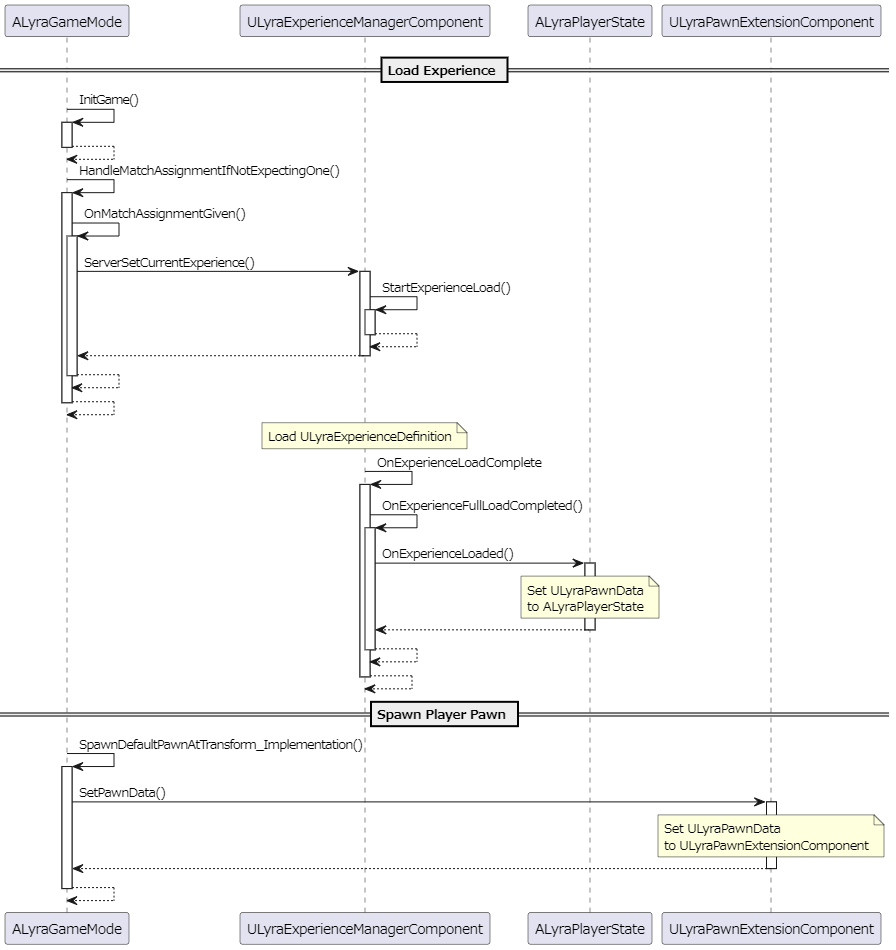

## ULyraPawnData

> Non-mutable data asset that contains properties used to define a pawn.  
> 
> ----
> ポーンを定義するために使用されるプロパティを含む、変更不可のデータアセットです。  

* 所有者 は [ALyraGameState]
	* エクスペリエンスのロード時に [ALyraGameState] に追加された [ULyraExperienceManagerComponent] のメンバ [ULyraExperienceDefinition] に設定される。
* キャッシュ
	* エクスペリエンスのロード後、 [ALyraPlayerState] に渡し、キャッシュをもたせる。
	* ポーンのスポーン時に [ALyraGameMode] にて [ULyraPawnExtensionComponent] に渡し、キャッシュをもたせる。

処理の流れは大まかに以下のようになっている。

### ULyraPawnData::PawnClass

> Class to instantiate for this pawn (should usually derive from ALyraPawn or ALyraCharacter).
> 
> ----

### ULyraPawnData::InputConfig

> Input configuration used by player controlled pawns to create input mappings and bind input actions.
> 
> ----

### ULyraPawnData::TagRelationshipMapping

> What mapping of ability tags to use for actions taking by this pawn
> 
> ----

### ULyraPawnData::DefaultCameraMode

> Default camera mode used by player controlled pawns.
> 
> ----

### ULyraPawnData::AbilitySets

> Ability sets to grant to this pawn's ability system.
> 
> ----

