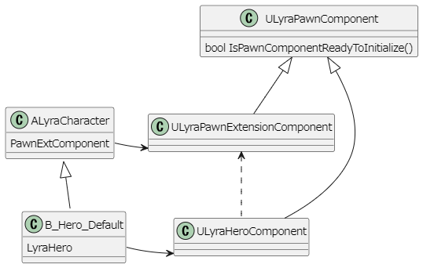
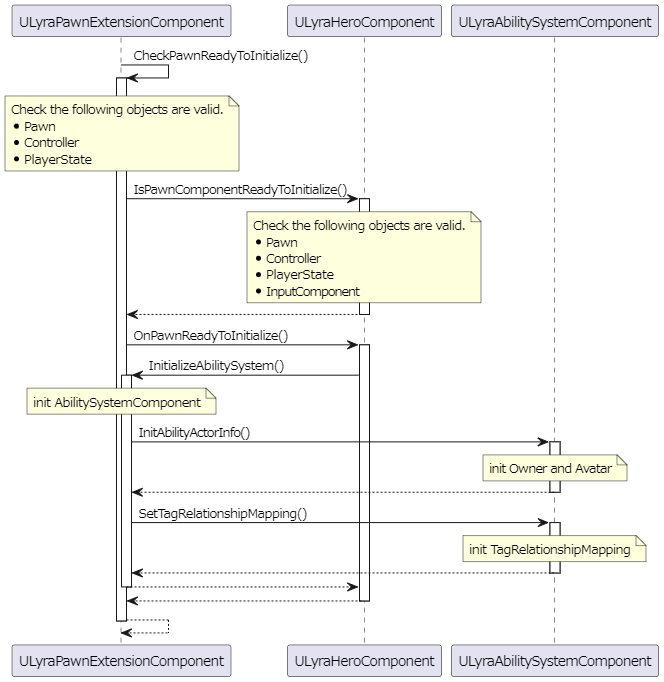
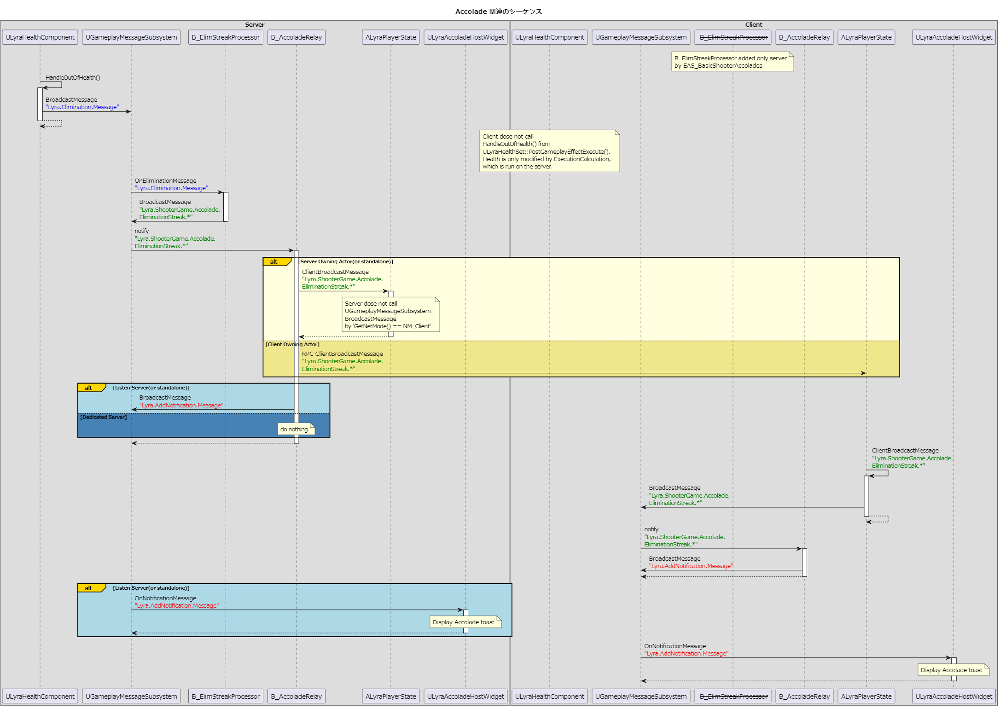
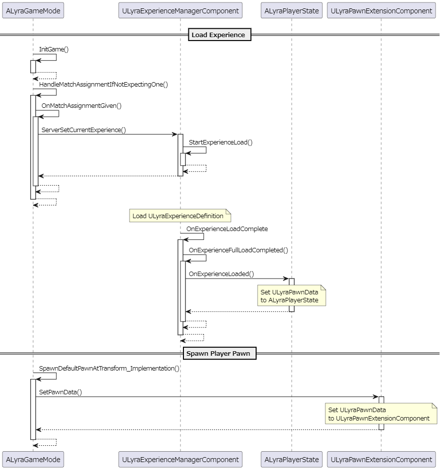

このドキュメントは書きかけです。
TODO: 確認していたものを全部書いていたら、なんのドキュメントかわからんくなってきたので、分割等を検討する。

# 【UE5】Lyra に学ぶ GAS(C++) <!-- omit in toc -->

UE5 の新しいサンプル [Lyra Starter Game] 。  
その中では、`Gameplay Ability System` （以降 GAS と略します） が利用されています。  
このドキュメントは GAS 関連の C++ で実装されている機能についての解説です。  

* バージョン
	* [Lyra Starter Game]
		* 2022/04/05 版

# Index <!-- omit in toc -->

- [UE で予め用意されている仕組みとそれを利用した拡張](#ue-で予め用意されている仕組みとそれを利用した拡張)
	- [GameFeature に関しての簡単な説明を書くよ](#gamefeature-に関しての簡単な説明を書くよ)
	- [DataRegistry に関しての簡単な説明を書くよ](#dataregistry-に関しての簡単な説明を書くよ)
	- [GameFeature を利用した DataRegistry の利用に関しての簡単な説明を書くよ](#gamefeature-を利用した-dataregistry-の利用に関しての簡単な説明を書くよ)
	- [GameFeature を利用した EnhancedInput の利用に関しての簡単な説明を書くよ](#gamefeature-を利用した-enhancedinput-の利用に関しての簡単な説明を書くよ)
- [Lyra で独自実装してている仕組み](#lyra-で独自実装してている仕組み)
	- [GameFeature を利用した エクスペリエンスについて簡単な説明を書くよ](#gamefeature-を利用した-エクスペリエンスについて簡単な説明を書くよ)
	- [GameplayMessageSubsystem について簡単な説明を書くよ](#gameplaymessagesubsystem-について簡単な説明を書くよ)
	- [MessageProcessor について簡単な説明を書くよ](#messageprocessor-について簡単な説明を書くよ)
	- [ULyraHeroComponent で実装設定できる FMappableConfigPair に関しての簡単な説明を書くよ](#ulyraherocomponent-で実装設定できる-fmappableconfigpair-に関しての簡単な説明を書くよ)
	- [GameplayAbility の一覧を継承ツリーベースで書くよ](#gameplayability-の一覧を継承ツリーベースで書くよ)
	- [ヘルスの管理方法と関連クラスについて簡単な説明を書くよ](#ヘルスの管理方法と関連クラスについて簡単な説明を書くよ)
	- [キャラクター設定関連について簡単な説明を書くよ](#キャラクター設定関連について簡単な説明を書くよ)
	- [ULyraPawnExtensionComponent と ULyraHeroComponent の関係](#ulyrapawnextensioncomponent-と-ulyraherocomponent-の関係)
- [GameFeature 関連（エンジン側）](#gamefeature-関連エンジン側)
	- [UGameFeatureAction](#ugamefeatureaction)
	- [UGameFeatureAction_DataRegistry](#ugamefeatureaction_dataregistry)
	- [UGameFeatureData](#ugamefeaturedata)
		- [UGameFeatureData::Actions](#ugamefeaturedataactions)
- [GameFeature 関連（ Lyra 側）](#gamefeature-関連-lyra-側)
	- [FMappableConfigPair](#fmappableconfigpair)
	- [UGameFeatureAction_AddInputBinding](#ugamefeatureaction_addinputbinding)
	- [UGameFeatureAction_AddInputContextMapping](#ugamefeatureaction_addinputcontextmapping)
- [エクスペリエンス 関連（ Lyra 側）](#エクスペリエンス-関連-lyra-側)
	- [ULyraExperienceActionSet](#ulyraexperienceactionset)
		- [ULyraExperienceActionSet::Actions](#ulyraexperienceactionsetactions)
	- [ULyraExperienceDefinition](#ulyraexperiencedefinition)
		- [ULyraExperienceDefinition::ActionSets](#ulyraexperiencedefinitionactionsets)
	- [ULyraExperienceManagerComponent](#ulyraexperiencemanagercomponent)
- [DataRegistry 関連（エンジン側）](#dataregistry-関連エンジン側)
	- [UDataRegistrySubsystem](#udataregistrysubsystem)
- [GameplayAbility 関連（エンジン側）](#gameplayability-関連エンジン側)
	- [UGameplayAbility](#ugameplayability)
		- [UGameplayAbility::MakeOutgoingGameplayEffectSpec()](#ugameplayabilitymakeoutgoinggameplayeffectspec)
		- [UGameplayAbility::ApplyAbilityTagsToGameplayEffectSpec()](#ugameplayabilityapplyabilitytagstogameplayeffectspec)
	- [FGameplayAbilitySpec](#fgameplayabilityspec)
		- [FGameplayAbilitySpec::DynamicAbilityTags](#fgameplayabilityspecdynamicabilitytags)
	- [FGameplayEffectSpec](#fgameplayeffectspec)
		- [FGameplayEffectSpec::CapturedSourceTags](#fgameplayeffectspeccapturedsourcetags)
- [GameplayAbility 関連（ Lyra 側）](#gameplayability-関連-lyra-側)
	- [ULyraGlobalAbilitySystem](#ulyraglobalabilitysystem)
	- [ULyraAbilitySystemComponent](#ulyraabilitysystemcomponent)
		- [ULyraAbilitySystemComponent::SetTagRelationshipMapping()](#ulyraabilitysystemcomponentsettagrelationshipmapping)
	- [ULyraGameplayAbility](#ulyragameplayability)
		- [ULyraGameplayAbility::ApplyAbilityTagsToGameplayEffectSpec()](#ulyragameplayabilityapplyabilitytagstogameplayeffectspec)
	- [ILyraReadyInterface](#ilyrareadyinterface)
		- [ILyraReadyInterface::IsPawnComponentReadyToInitialize()](#ilyrareadyinterfaceispawncomponentreadytoinitialize)
	- [ULyraPawnComponent](#ulyrapawncomponent)
	- [ULyraPawnExtensionComponent](#ulyrapawnextensioncomponent)
		- [ULyraPawnExtensionComponent::CheckPawnReadyToInitialize()](#ulyrapawnextensioncomponentcheckpawnreadytoinitialize)
		- [ULyraPawnExtensionComponent::PawnData](#ulyrapawnextensioncomponentpawndata)
		- [ULyraPawnExtensionComponent::GetPawnData()](#ulyrapawnextensioncomponentgetpawndata)
		- [ULyraPawnExtensionComponent::SetPawnData()](#ulyrapawnextensioncomponentsetpawndata)
		- [ULyraPawnExtensionComponent::AbilitySystemComponent](#ulyrapawnextensioncomponentabilitysystemcomponent)
		- [ULyraPawnExtensionComponent::GetLyraAbilitySystemComponent()](#ulyrapawnextensioncomponentgetlyraabilitysystemcomponent)
		- [ULyraPawnExtensionComponent::InitializeAbilitySystem()](#ulyrapawnextensioncomponentinitializeabilitysystem)
		- [ULyraPawnExtensionComponent::UninitializeAbilitySystem()](#ulyrapawnextensioncomponentuninitializeabilitysystem)
	- [ULyraHeroComponent](#ulyraherocomponent)
		- [ULyraHeroComponent::DefaultInputConfigs](#ulyraherocomponentdefaultinputconfigs)
		- [ULyraHeroComponent::IsPawnComponentReadyToInitialize()](#ulyraherocomponentispawncomponentreadytoinitialize)
		- [ULyraHeroComponent::OnPawnReadyToInitialize()](#ulyraherocomponentonpawnreadytoinitialize)
		- [ULyraHeroComponent::InitializePlayerInput()](#ulyraherocomponentinitializeplayerinput)
		- [ULyraHeroComponent::DetermineCameraMode()](#ulyraherocomponentdeterminecameramode)
	- [ULyraAbilitySet](#ulyraabilityset)
		- [ULyraAbilitySet::GiveToAbilitySystem()](#ulyraabilitysetgivetoabilitysystem)
	- [ULyraAbilityTagRelationshipMapping](#ulyraabilitytagrelationshipmapping)
	- [ULyraGameplayAbility_FromEquipment](#ulyragameplayability_fromequipment)
	- [ULyraGameplayAbility_RangedWeapon](#ulyragameplayability_rangedweapon)
	- [ULyraGameplayAbility_Reset](#ulyragameplayability_reset)
	- [ULyraGamePhaseAbility](#ulyragamephaseability)
	- [ULyraAttributeSet](#ulyraattributeset)
	- [ULyraHealthSet](#ulyrahealthset)
		- [ULyraHealthSet::Health](#ulyrahealthsethealth)
		- [ULyraHealthSet::MaxHealth](#ulyrahealthsetmaxhealth)
		- [ULyraHealthSet::Healing](#ulyrahealthsethealing)
		- [ULyraHealthSet::Damage](#ulyrahealthsetdamage)
	- [ULyraHealthComponent](#ulyrahealthcomponent)
- [GameplayMessage 関連（ Lyra 側）](#gameplaymessage-関連-lyra-側)
	- [UGameplayMessageSubsystem](#ugameplaymessagesubsystem)
		- [UGameplayMessageSubsystem::BroadcastMessage()](#ugameplaymessagesubsystembroadcastmessage)
- [GameplayMessage Processor 関連（ Lyra 側）](#gameplaymessage-processor-関連-lyra-側)
	- [UGameplayMessageProcessor](#ugameplaymessageprocessor)
	- [UElimChainProcessor](#uelimchainprocessor)
	- [UElimStreakProcessor](#uelimstreakprocessor)
	- [UAssistProcessor](#uassistprocessor)
- [GameplayMessage MessageStruct 関連（ Lyra 側）](#gameplaymessage-messagestruct-関連-lyra-側)
	- [FLyraControlPointStatusMessage](#flyracontrolpointstatusmessage)
	- [FLyraInteractionDurationMessage](#flyrainteractiondurationmessage)
	- [FLyraNotificationMessage](#flyranotificationmessage)
		- [FLyraNotificationMessage::PayloadTag](#flyranotificationmessagepayloadtag)
	- [FLyraQuickBarActiveIndexChangedMessage](#flyraquickbaractiveindexchangedmessage)
	- [FLyraQuickBarSlotsChangedMessage](#flyraquickbarslotschangedmessage)
	- [FLyraInventoryChangeMessage](#flyrainventorychangemessage)
	- [FLyraPlayerResetMessage](#flyraplayerresetmessage)
	- [FLyraAbilitySimpleFailureMessage](#flyraabilitysimplefailuremessage)
	- [FLyraAbilityMontageFailureMessage](#flyraabilitymontagefailuremessage)
	- [FLyraVerbMessage](#flyraverbmessage)
	- [FLyraVerbMessageReplication](#flyraverbmessagereplication)
- [GameplayMessage Accolade 関連（ Lyra 側）](#gameplaymessage-accolade-関連-lyra-側)
	- [FLyraAccoladeDefinitionRow](#flyraaccoladedefinitionrow)
	- [ULyraAccoladeHostWidget](#ulyraaccoladehostwidget)
- [Lyra インベントリ関連](#lyra-インベントリ関連)
	- [FLyraInventoryList](#flyrainventorylist)
- [Lyra GameplayCue 関連](#lyra-gameplaycue-関連)
	- [AGameplayCueNotify_BurstLatent](#agameplaycuenotify_burstlatent)
- [Lyra キャラクター設定関連](#lyra-キャラクター設定関連)
	- [ULyraPawnData](#ulyrapawndata)
		- [ULyraPawnData::InputConfig](#ulyrapawndatainputconfig)
		- [ULyraPawnData::TagRelationshipMapping](#ulyrapawndatatagrelationshipmapping)
		- [ULyraPawnData::DefaultCameraMode](#ulyrapawndatadefaultcameramode)
		- [ULyraPawnData::AbilitySets](#ulyrapawndataabilitysets)
- [Lyra widget 関連](#lyra-widget-関連)
	- [ULyraReticleWidgetBase](#ulyrareticlewidgetbase)
	- [ULyraTaggedWidget](#ulyrataggedwidget)
- [Lyra その他](#lyra-その他)
	- [ALyraCharacter](#alyracharacter)
	- [ALyraGameMode](#alyragamemode)
		- [ALyraGameMode::GetPawnDataForController()](#alyragamemodegetpawndataforcontroller)
	- [ALyraGameState](#alyragamestate)
		- [ALyraGameState::MulticastMessageToClients()](#alyragamestatemulticastmessagetoclients)
		- [ALyraGameState::MulticastReliableMessageToClients()](#alyragamestatemulticastreliablemessagetoclients)
	- [ALyraPlayerState](#alyraplayerstate)
		- [ALyraPlayerState::StatTags](#alyraplayerstatestattags)
		- [ALyraPlayerState::OnExperienceLoaded()](#alyraplayerstateonexperienceloaded)
		- [ALyraPlayerState::SetPawnData()](#alyraplayerstatesetpawndata)
		- [ALyraPlayerState::ClientBroadcastMessage()](#alyraplayerstateclientbroadcastmessage)
	- [ALyraWeaponSpawner](#alyraweaponspawner)
	- [ULyraCameraMode](#ulyracameramode)
	- [ULyraCheatManager](#ulyracheatmanager)
	- [ULyraSettingsLocal](#ulyrasettingslocal)
	- [ULyraDamageLogDebuggerComponent](#ulyradamagelogdebuggercomponent)
	- [ULyraQuickBarComponent](#ulyraquickbarcomponent)
	- [ULyraBotCreationComponent](#ulyrabotcreationcomponent)
- [終わりに](#終わりに)

# UE で予め用意されている仕組みとそれを利用した拡張

## GameFeature に関しての簡単な説明を書くよ

* [UGameFeatureData]
* [UGameFeatureAction]

## DataRegistry に関しての簡単な説明を書くよ

* [UDataRegistrySubsystem]

## GameFeature を利用した DataRegistry の利用に関しての簡単な説明を書くよ

* [UGameFeatureAction_DataRegistry]

## GameFeature を利用した EnhancedInput の利用に関しての簡単な説明を書くよ

* [UGameFeatureAction_AddInputBinding]
* [UGameFeatureAction_AddInputContextMapping]

# Lyra で独自実装してている仕組み

## GameFeature を利用した エクスペリエンスについて簡単な説明を書くよ

* [UGameFeatureAction]
* [UGameFeatureData]
* [ULyraExperienceActionSet]
* [ULyraExperienceDefinition]

## GameplayMessageSubsystem について簡単な説明を書くよ

[GASDocumentation(和訳) > 11.1.2 Community Questions] の第 4 項目より

> Q:  
> Main では、しばらくの間、 Gameplay Messages を送信するためのプラグイン（Event/Message Bus のようなもの）がありましたが、削除されてしまいました。  
> 復活させる予定はありますか？  
> Game Features/Modular Gameplay プラグインでは、汎用の Event Bus Dispatcher があると非常に便利です。  
> A:  
> GameplayMessages プラグインのことを言っているのだと思います。  
> これはおそらく、いつかは戻ってくるでしょう - API がまだ完成しておらず、作者もまだ公開するつもりはなかったようです。  
> Modular Gameplay デザインに有用であることには同意します。  
> しかし、これは私の分野ではないので、これ以上の情報はありません。  

おそらくこれのことだと思います。

## MessageProcessor について簡単な説明を書くよ

* [UGameplayMessageProcessor]
* [UElimChainProcessor]
* [UElimStreakProcessor]
* [UAssistProcessor]
* 送信データ
	* [FLyraControlPointStatusMessage]
	* [FLyraInteractionDurationMessage]
	* [FLyraNotificationMessage]
	* [FLyraQuickBarActiveIndexChangedMessage]
	* [FLyraQuickBarSlotsChangedMessage]
	* [FLyraInventoryChangeMessage]
	* [FLyraPlayerResetMessage]
	* [FLyraAbilitySimpleFailureMessage]
	* [FLyraAbilityMontageFailureMessage]
	* [FLyraVerbMessage]
* [FLyraVerbMessageReplication]

## ULyraHeroComponent で実装設定できる FMappableConfigPair に関しての簡単な説明を書くよ

* [ULyraHeroComponent]
* [FMappableConfigPair]

## GameplayAbility の一覧を継承ツリーベースで書くよ

## ヘルスの管理方法と関連クラスについて簡単な説明を書くよ

* [ULyraHealthComponent]
* [ULyraHealthSet]

## キャラクター設定関連について簡単な説明を書くよ

* [ULyraPawnData]

## ULyraPawnExtensionComponent と ULyraHeroComponent の関係

* 主に ShooterGmae でのキャラクターの GAS の制御は、 [ULyraPawnExtensionComponent] と [ULyraHeroComponent] が連携して動いています。
* その他、以下のクラスの関連しています。
	* [ILyraReadyInterface]
	* [ULyraPawnComponent]
	* [ULyraPawnExtensionComponent]
	* [ULyraHeroComponent]

関係は以下のような形。

[ULyraPawnExtensionComponent] / [ULyraHeroComponent] に関しては [Lyra のアビリティ > ALyraPlayerState] にて以下の記述があります。

> Lyra ではこれを ULyraHeroComponent および ULyraPawnExtensionComponent を通じて対応します。  
> これらのコンポーネントは、有効なコントローラーで所有されたときに、Abilities、Attributes、Gameplay Effects の特定セットを  
> PlayerState の AbilitySystemComponent に付与する処理を担当します。  
> これらは、ポーンが除外、所有解除、またはプレイから他の方法で削除されたときに、自動的に取り消されます。  

この 2 つのクラスの特徴は概ね以下のようになります。

|                               | [ULyraPawnExtensionComponent]                | [ULyraHeroComponent]                                 |
|-------------------------------|----------------------------------------------|------------------------------------------------------|
| 他方を参照するか              | 参照しない                                   | 参照する                                             |
| アビリティ関連の役割          | キャラクターに依らない ASC の初期化/終了関連 | キャラクターに依る、アビリティの付与、アクティブ化等 |
| 追加する Pawn                 | [ALyraCharacter]                             | `B_Hero_Default`                                     |
| コンポーネントの動作          | 追加だけでは影響を与えない                   | 追加だけで動作する                                   |
| Pawn からの利用方法           | 必要に応じてメンバ関数を呼び出す             | メンバ関数の呼び出しはしていない                     |
| 参照するクラス                | [ALyraCharacter]                             | [ULyraGameplayAbility]                               |
|                               | [ULyraHeroComponent]                         | [UGameFeatureAction_AddInputBinding]                 |
|                               | [ALyraGameMode]                              | [UGameFeatureAction_AddInputContextMapping]          |
|                               | [ALyraPlayerState]                           |                                                      |
|                               | [ULyraBotCreationComponent]                  |                                                      |
|                               | [ULyraCheatManager]                          |                                                      |
| [ALyraCharacter] を参照するか | する（ `Crouch` 関連）                       | しない                                               |

> note:  
> * キャラクターに依存する/しないでクラスを分けることで、異なる付与ルールのキャラクターを新たに追加しやすくしている。
> * 依存しない部分については [ULyraPawnExtensionComponent] で実装し [ALyraCharacter] に追加している。
> * [ALyraCharacter] を派生することで、その機能を利用できるようにしている。
> 
> 例えば、 Hero とは異なるルールのキャラクターを作りたい場合は以下のようなる。  
> * [ULyraHeroComponent] のようなクラスを別途作る
> * `B_Hero_Default` のような [ALyraCharacter] 派生 BP クラスを別途作り、上記のコンポーネントを追加する

----

以降はクラスの説明。

# GameFeature 関連（エンジン側）

## UGameFeatureAction

> Represents an action to be taken when a game feature is activated  
> 
> ----

## UGameFeatureAction_DataRegistry

> Specifies a list of Data Registries to load and initialize with this feature  
> 
> ----

* [UGameFeatureAction] の派生クラス。

## UGameFeatureData

> Data related to a game feature, a collection of code and content that adds a separable discrete feature to the game  
> 
> ----

### UGameFeatureData::Actions

> List of actions to perform as this game feature is loaded/activated/deactivated/unloaded  
> 
> ----

* [UGameFeatureAction] の配列。

# GameFeature 関連（ Lyra 側）

## FMappableConfigPair

> A container to organize potentially unloaded player mappable configs to their CommonUI input type  
> 
> ----

## UGameFeatureAction_AddInputBinding

> Adds InputMappingContext to local players' EnhancedInput system. 
> Expects that local players are set up to use the EnhancedInput system.  
> 
> ----

## UGameFeatureAction_AddInputContextMapping

> Adds InputMappingContext to local players' EnhancedInput system. 
> Expects that local players are set up to use the EnhancedInput system.  
> 
> ----

# エクスペリエンス 関連（ Lyra 側）

## ULyraExperienceActionSet

> Definition of a set of actions to perform as part of entering an experience  
> 
> ----

* [ULyraExperienceDefinition::ActionSets] で利用される。

### ULyraExperienceActionSet::Actions

> List of actions to perform as this experience is loaded/activated/deactivated/unloaded  
> 
> ----

* [UGameFeatureAction] の配列。

## ULyraExperienceDefinition

> Definition of an experience  
> 
> ----

* 

### ULyraExperienceDefinition::ActionSets

* [ULyraExperienceActionSet] の配列。

## ULyraExperienceManagerComponent

* `UGameStateComponent` の派生クラス。

# DataRegistry 関連（エンジン側）

## UDataRegistrySubsystem

> Singleton manager that provides synchronous and asynchronous access to data registries  
> 
> ----

# GameplayAbility 関連（エンジン側）

## UGameplayAbility

### UGameplayAbility::MakeOutgoingGameplayEffectSpec()

> Convenience method for abilities to get outgoing gameplay effect specs  
> (for example, to pass on to projectiles to apply to whoever they hit)  
> 
> ----
> アビリティがゲームプレイエフェクト Spec を外部に出すための便利な方法  
> （例えば、投射物に渡して、当たった人に適用させるなど）。  

* `GameplayEffectSpec` を作るための関数で、ブループリントにも公開されている。
* [UGameplayAbility::ApplyAbilityTagsToGameplayEffectSpec()] を呼び出す。

### UGameplayAbility::ApplyAbilityTagsToGameplayEffectSpec()

> Add the Ability's tags to the given GameplayEffectSpec. This is likely to be overridden per project.  
> 
> ----
> 与えられたGameplayEffectSpecに、Abilityのタグを追加します。これは、プロジェクトごとにオーバーライドされる可能性が高いです。  

* 仮想関数。
* [UGameplayAbility::MakeOutgoingGameplayEffectSpec()] から呼ばれる。
* 渡された [FGameplayEffectSpec::CapturedSourceTags] に [FGameplayAbilitySpec::DynamicAbilityTags] を追加する。

## FGameplayAbilitySpec

> An activatable ability spec, hosted on the ability system component.  
> This defines both what the ability is (what class, what level, input binding etc)  
> and also holds runtime state that must be kept outside of the ability being instanced/activated.  
> 
> ----
> アビリティシステムコンポーネントでホストされる、起動可能なアビリティ Spec です。  
> これはアビリティが何であるか(どのクラス、どのレベル、入力バインディングなど)を定義するものである。  
> また、インスタンス化/アクティブ化されたアビリティの外側に保持されなければならない実行時状態も保持します。  

### FGameplayAbilitySpec::DynamicAbilityTags

> Optional ability tags that are replicated.  
> These tags are also captured as source tags by applied gameplay effects.  
> 
> ----
> 複製されるオプションのアビリティタグ。  
> これらのタグは、適用されたゲームプレイエフェクトによってソースタグとしてもキャプチャされる。  

* Lyra での利用
	* **InputTag** が設定されます。

## FGameplayEffectSpec

> GameplayEffect Specification. Tells us:  
> - What UGameplayEffect (const data)
> - What Level
> - Who instigated
>  
> FGameplayEffectSpec is modifiable. We start with initial conditions and modifications be applied to it.  
> In this sense, it is stateful/mutable but it is still distinct from an FActiveGameplayEffect which in an applied instance of an FGameplayEffectSpec.  
> 
> ----
> ゲームプレイエフェクトの仕様です。説明  
> - どの UGameplayEffect (const data) か
> - どのようなレベルか
> - 誰が実行したか
>  
> FGameplayEffectSpec は変更可能である。初期状態から始まり、修正が適用される。  
> この意味で、ステートフル／ミュータブルですが、FGameplayEffectSpec を適用したインスタンスである FActiveGameplayEffect とは区別される。  

### FGameplayEffectSpec::CapturedSourceTags

> Captured Source Tags on GameplayEffectSpec creation  
> 
> ----
> GameplayEffectSpec 作成時にキャプチャされたソースタグ。  

* Lyra での役割
	* [FGameplayAbilitySpec::DynamicAbilityTags] に **InputTag** が設定される都合上、ここにも **InputTag** がキャプチャされる。
	* 利用されているかは未確認。

# GameplayAbility 関連（ Lyra 側）

## ULyraGlobalAbilitySystem

[Lyra のアビリティ > ULyraGlobalAbilitySystem] より  
> たとえば、Lyra の Elimination モードは、マッチのウォームアップ フェーズで、  
> グローバルに Gameplay Effect (GE_PregameLobby) を適用します。  
> これはすべてのプレイヤーに対するダメージ無効化タグを付与し、  
> マッチがまだ開始されていないことを示す UI 要素を有効にする Gameplay Cue (ゲームプレイ キュー) をトリガーします。  

> TODO:  
> ゲームプレイに影響する UI の表示を Gameplay Cue で扱っていいのだろうか…？  
> （UIの表示によりユーザーの入力を抑制しているのであれば、ゲームプレイに影響するはず？要確認）  

* `UWorldSubsystem` の派生クラス。
* TODO: 必要に応じて追記。

## ULyraAbilitySystemComponent

* TODO: ソースを見て追記事項があれば。

* `UGameplayTasksComponent` -> `UAbilitySystemComponent` -> `UActorComponent` の派生クラス。
* [FGameplayAbilitySpec::DynamicAbilityTags] について
	* 入力アクションが発生した際、バインドされた **InputTag** をキーに [FGameplayAbilitySpec] を探す。
	* その際、 [FGameplayAbilitySpec::DynamicAbilityTags] に **InputTag** を持つかで判定している。

### ULyraAbilitySystemComponent::SetTagRelationshipMapping()

## ULyraGameplayAbility

> The base gameplay ability class used by this project.  
> 
> ----

* `UGameplayAbility` の派生クラス。

### ULyraGameplayAbility::ApplyAbilityTagsToGameplayEffectSpec()

[UGameplayAbility::MakeOutgoingGameplayEffectSpec()]

## ILyraReadyInterface

* コンポーネントの準備状態を判定するための関数を定義したインターフェイス。
* Lyra での使われ方
	* [ULyraPawnComponent] のみが継承している。
	* この機能を利用する他のクラスは [ULyraPawnComponent] を継承している。

### ILyraReadyInterface::IsPawnComponentReadyToInitialize()

* このコンポーネントが動作する準備ができている場合は true を返す。
* ネットワークを介している場合、プロパティのレプリケーションや `Possess` の順が不定のため、それを吸収するために利用される。

## ULyraPawnComponent

> An actor component that can be used for adding custom behavior to pawns.  
> 
> ----
> ポーンにカスタム動作を追加するために使用することができるアクターコンポーネントです。  

* `UPawnComponent` の派生クラス。
* [ILyraReadyInterface] のインターフェイスを持つ以外は何も実装されていない。
* Pawn に所有させるコンポーネントの基底クラス。
	* Lyra の全てのポーン用コンポーネント基底クラスと使用しているわけではない。
	* 例えば以下は `UPawnComponent` から派生している。
		* [ULyraPawnComponent_CharacterParts]
		* [ULyraEquipmentManagerComponent]

## ULyraPawnExtensionComponent

> Component used to add functionality to all Pawn classes.  
> 
> ----
> すべての Pawn クラスに機能を追加するために使用されるコンポーネントです。  

* 主な役割
	* Pawn に追加された全てのコンポーネントの準備ができているかのチェック。
		* [ULyraPawnExtensionComponent::CheckPawnReadyToInitialize()]
	* Pawn 用の [ULyraAbilitySystemComponent] の Initialize / Uninitialize の処理。
		* [ULyraPawnExtensionComponent::InitializeAbilitySystem()] / [ULyraPawnExtensionComponent::UninitializeAbilitySystem()]
	* なお、この 2 つの機能はこのクラスだけでは連動していない。
		* 準備のチェックから直接アビリティシステムの初期化は呼び出されない。（デリゲート経由で外部から呼ばれる。）
		* 要は、機能を明確にするのを目的にコンポーネントを分けようと思えば分けられる。
* その他の役割
	* [ULyraPawnData] のキャッシュの保持。
		* [ULyraPawnExtensionComponent::PawnData]
	* [ULyraAbilitySystemComponent] のキャッシュの保持。
		* [ULyraPawnExtensionComponent::AbilitySystemComponent]
* 利用しているクラス
	* [ALyraCharacter] に追加されている。

### ULyraPawnExtensionComponent::CheckPawnReadyToInitialize()

> Call this anytime the pawn needs to check if it's ready to be initialized (pawn data assigned, possessed, etc..).  
> 
> ----
> ポーンが初期化（ポーンデータの割り当て、所持など）の準備ができたかどうかを確認する必要があるときはいつでもこれを呼び出します。  

処理の流れは大まかに以下のような形。

* このコンポーネントが追加された Pawn の初期化のチェックを行う
* Pawn に追加されたコンポーネントを走査して、 [ILyraReadyInterface] を持つものを探す。
* 見つかった対象に対し、初期化が済んでいるかのチェックを行う。
	* [ILyraReadyInterface::IsPawnComponentReadyToInitialize()] を利用する。
	* [ILyraReadyInterface::IsPawnComponentReadyToInitialize()] はここでのみ呼び出される。
* 全て初期化が済んでいたら、登録されたデリゲートを呼び出す。

* [ILyraReadyInterface::IsPawnComponentReadyToInitialize()] を利用し実装されている。
* チェックが通ったら、登録されたデリゲートを呼び出す。

### ULyraPawnExtensionComponent::PawnData
### ULyraPawnExtensionComponent::GetPawnData()
### ULyraPawnExtensionComponent::SetPawnData()

> Pawn data used to create the pawn.  Specified from a spawn function or on a placed instance.  
> 
> ----
> ポーンの作成に使用するポーンデータです。 スポーン関数や配置されたインスタンスから指定されます。  

* 主に [ULyraHeroComponent] が使用したい際に利用される。
* 指定方法
	* プレイヤーポーンがスポーンする際に指定する
		* [ULyraPawnExtensionComponent::SetPawnData()] が呼び出され、初期化される。
	* 配置されたインスタンスで直接指定する
* 外部からの利用の際は [ULyraPawnExtensionComponent::GetPawnData()] を経由する。
	* これはテンプレート関数で、テンプレート引数は戻り値の型となっている。
	* このクラスで所持するオブジェクトは [ULyraPawnData] 派生型を想定している。
	* つまり、[ULyraPawnData] 派生型を用意して、独自のキャラクターの初期化情報を追加することを想定している。
* 自クラスからの参照
	* [ULyraPawnExtensionComponent::InitializeAbilitySystem()]
		* [ULyraPawnData::TagRelationshipMapping] をタグリレーションシップマッピング情報として [ULyraAbilitySystemComponent::SetTagRelationshipMapping()] に渡す。
* 他クラスからの参照
	* [ULyraHeroComponent::InitializePlayerInput()]
		* [ULyraPawnData::InputConfig] を入力マッピングの追加と入力アクションのバインドに使用。
	* [ULyraHeroComponent::DetermineCameraMode()]
		* [ULyraPawnData::DefaultCameraMode] をデフォルトのカメラモードとして使用。

### ULyraPawnExtensionComponent::AbilitySystemComponent
### ULyraPawnExtensionComponent::GetLyraAbilitySystemComponent()

> Pointer to the ability system component that is cached for convenience.  
> 
> ----
> 利便性のためにキャッシュされたアビリティシステムコンポーネントへのポインター。  

* [ULyraAbilitySystemComponent] の初期化/終了処理を行うためにキャッシュを所持している。
* 他クラスからの参照
	* [ALyraCharacter]
	* [ULyraHeroComponent]
		* [ULyraPawnExtensionComponent::InitializeAbilitySystem()] を呼び出されることで初期化される。
		* 初期化後は、 [ULyraAbilitySystemComponent] へのアクセスはこのキャッシュを利用する。

### ULyraPawnExtensionComponent::InitializeAbilitySystem()

> Should be called by the owning pawn to become the avatar of the ability system.  
> 
> ----
> アビリティシステムのアバターになるために、所有するポーンから呼び出される必要があります。  

* [ULyraAbilitySystemComponent] の基本的な初期化に加え、 [ULyraAbilitySystemComponent::SetTagRelationshipMapping()] の呼び出しを行っている。
	* [ULyraAbilityTagRelationshipMapping] 関連はキャラクターに依らないため、このクラス経由で扱っている。

### ULyraPawnExtensionComponent::UninitializeAbilitySystem()

> Should be called by the owning pawn when the pawn's controller changes.  
> 
> ----
> ポーンのコントローラーが変わった時に、所有するポーンから呼び出される必要があります。  

## ULyraHeroComponent

> A component used to create a player controlled pawns (characters, vehicles, etc..).  
> 
> ----
> プレイヤーが制御するポーン（キャラクター、ビークルなど）を作成するために使用されるコンポーネント。  

* 主な役割
	* 入力時のロジックの実装と Enhanced Input との関連付け。
	* [ULyraPawnExtensionComponent] のアビリティシステム関連の機能呼び出し。
	* アビリティによるカメラ情報の保持。
* 追加しているポーン
	* C++ では追加していない。
	* `B_Hero_Default` （キャラクターの BP の基底クラス） で追加している。
* [ULyraPawnExtensionComponent] との関係
	* 参照方法
		* 自身を追加している Pawn に `FindComponentByClass<ULyraPawnExtensionComponent>()` を呼び出すことで参照している。
	* 用途
		* [ULyraPawnData] を使用するとき。
		* [ULyraAbilitySystemComponent] を使用するとき。
* [ULyraPawnData] との関係
	* `InputConfig` / `DefaultCameraMode` を参照している。
* [ULyraAbilitySystemComponent] との関係
	* クラス内でキャッシュを持たない。
	* 初期化時（ [ULyraHeroComponent::OnPawnReadyToInitialize()] ）に [ALyraPlayerState] から取得し、 [ULyraPawnExtensionComponent] に設定する。
	* 以降、アクセス時は [ULyraPawnExtensionComponent] 経由で行う。
* [ALyraCharacter] との関係
	* ほぼ無い。
	* [ALyraCharacter::ToggleCrouch()] の機能を利用するときのみ参照している。
		* ただ、上記の関数は `ACharacter` の機能しか利用していないので、最悪参照なしでも実装可能。そのぐらいの関係性の低さ。

### ULyraHeroComponent::DefaultInputConfigs

> Input Configs that should be added to this player when initalizing the input.  
> NOTE: You should only add to this if you do not have a game feature plugin accessible to you.  
> If you do, then use the GameFeatureAction_AddInputConfig instead.  
> 
> ----
> 入力 入力時にこのプレーヤーに追加されるべきコンフィグ。  
> 注：この設定は、ゲームフィーチャープラグインにアクセスできない場合にのみ追加する必要があります。  
> もしあるならば、代わりに GameFeatureAction_AddInputConfig を使用してください。  

* [FMappableConfigPair] の配列を保持している。
	* この設定は [ULyraHeroComponent::InitializePlayerInput()] で読み込まれ、 [ULyraSettingsLocal] に反映される。
		* [ULyraSettingsLocal] に反映された内容は [ULyraInputComponent::AddInputMappings()] で Enhanced Input にマッピングの追加をされる。
		* 上記のコメントの通り、 Game Feature を使用しない場合にこのプロパティを設定することを想定されている。
* 利用しているクラス
	* `B_SimplePawn`

### ULyraHeroComponent::IsPawnComponentReadyToInitialize()

* 自身を所有している Pawn の Controller/PlayerState/Owner/InputComponent などの関連付け状態のチェックを行う。
* 個のコンポーネントの準備というより、自身を追加している Pawn の準備の確認を行っている。

### ULyraHeroComponent::OnPawnReadyToInitialize()

* [ULyraPawnExtensionComponent] に登録するデリゲート用の関数。
* [ULyraPawnExtensionComponent::InitializeAbilitySystem()] を呼び出す。
	* 引数の [ULyraAbilitySystemComponent] は [ALyraPlayerState] から受け取ったものを渡す。
* [ULyraHeroComponent::InitializePlayerInput()] を呼び出す。

### ULyraHeroComponent::InitializePlayerInput()

* 主に入力マッピングの追加と入力アクションのバインドを行う。
* [ULyraHeroComponent::OnPawnReadyToInitialize()] から呼ばれる。

### ULyraHeroComponent::DetermineCameraMode()

* 状況に応じたカメラモード [ULyraCameraMode] を返す。

## ULyraAbilitySet

> Non-mutable data asset used to grant gameplay abilities and gameplay effects.  
> 
> ----
> ゲームプレイアビリティおよびゲームプレイエフェクトを付与するために使用される非ミュータブルなデータアセット。  

### ULyraAbilitySet::GiveToAbilitySystem()

* 渡された [ULyraAbilitySystemComponent] の Owner が `authoritative` ならばアビリティを付与する。
	* 付与する際、 [FGameplayAbilitySpec::DynamicAbilityTags] に **InputTag** を設定する。
		* この値は、入力があった際に **InputTag** から [FGameplayAbilitySpec] を見つけるのに利用される。
		* 詳しくは [ULyraAbilitySystemComponent] 参照。

## ULyraAbilityTagRelationshipMapping

> Mapping of how ability tags block or cancel other abilities  

* GameplayAbility の GameplayTag によるブロックやキャンセルの定義をまとめた構造体。
* [ULyraAbilitySystemComponent] から利用される。

## ULyraGameplayAbility_FromEquipment

> An ability granted by and associated with an equipment instance  
> 
> ----

* [ULyraGameplayAbility] の派生クラス。

## ULyraGameplayAbility_RangedWeapon

> An ability granted by and associated with a ranged weapon instance  
> 
> ----

* [ULyraGameplayAbility_FromEquipment] の派生クラス。

## ULyraGameplayAbility_Reset

> Gameplay ability used for handling quickly resetting the player back to initial spawn state.  
> Ability is activated automatically via the "GameplayEvent.RequestReset" ability trigger tag (server only).  
> 
> ----

* [ULyraGameplayAbility] の派生クラス。

## ULyraGamePhaseAbility

> The base gameplay ability for any ability that is used to change the active game phase.  
> 
> ----

* [ULyraGameplayAbility] の派生クラス。

## ULyraAttributeSet

> Base attribute set class for the project.  
> 
> ----

* `UAttributeSet` の派生クラス。

## ULyraHealthSet

> Class that defines attributes that are necessary for taking damage.  
> Attribute examples include: health, shields, and resistances.  
> 
> ----

* [ULyraAttributeSet] の派生クラス。

### ULyraHealthSet::Health

> The current health attribute.  
> The health will be capped by the max health attribute.  
> Health is hidden from modifiers so only executions can modify it.  
> 
> ----
> 現在のヘルス属性です。  
> ヘルスは最大ヘルス属性で上限が設定されます。  
> ヘルスは modifier から隠されているので、 execution のみが修正可能です。  

### ULyraHealthSet::MaxHealth

> The current max health attribute.  
> Max health is an attribute since gameplay effects can modify it.  
> 
> ----
> 現在の最大ヘルス属性です。  
> 最大ヘルスはゲームプレイエフェクトで変更が可能なため、属性として扱われます。  

### ULyraHealthSet::Healing

> Incoming healing. This is mapped directly to +Health  
> 
> ----

* いわゆるメタ属性。

### ULyraHealthSet::Damage

> Incoming damage. This is mapped directly to -Health  
> 
> ----

> Damage is hidden from modifiers so only executions can modify it.  
> 
> ----

* いわゆるメタ属性。
* `UPROPERTY` の `Meta` にて `HideFromModifiers` が指定されている。
* そのため、 [ULyraAttributeSet::Health] と同様に modifier では変更できず execution(`UGameplayEffectExecutionCalculation` 派生クラス) のみで修正可能です。

## ULyraHealthComponent

* `UGameFrameworkComponent` -> `UActorComponent` の派生クラス。

# GameplayMessage 関連（ Lyra 側）

## UGameplayMessageSubsystem

> This system allows event raisers and listeners to register for messages without having to know about each other directly,  
> though they must agree on the format of the message (as a USTRUCT() type).  
>  
> You can get to the message router from the game instance:  
> 	UGameInstance::GetSubsystem<UGameplayMessageSubsystem>(GameInstance)  
> or directly from anything that has a route to a world:  
> 	UGameplayMessageSubsystem::Get(WorldContextObject)  
>  
> Note that call order when there are multiple listeners for the same channel is not guaranteed and can change over time!  
> 
> ----
> このシステムにより、イベント発信者と受信者は、メッセージのフォーマット（USTRUCT()型として）に合意する必要があるものの、  
> 互いのことを直接知らなくても、メッセージを登録することができるようになります。  
>  
> メッセージルーターは、ゲームインスタンスから:  
> 	UGameInstance::GetSubsystem<UGameplayMessageSubsystem>(GameInstance)  
> またはワールドへのルートを持つものから直接取得できます。  
> 	UGameplayMessageSubsystem::Get(WorldContextObject)  
>  
> 同じチャンネルに複数のリスナーがいる場合の呼び出し順は保証されておらず、  
> 時間の経過とともに変化する可能性があることに注意してください。  

* `UGameInstanceSubsystem` の派生クラス。

利用状況は概ね以下の通り。

| Channel | 送信者 | 受信者 | メッセージの型 | 内容 |
| ---- | ---- | ---- | ---- | ---- |
| `Ability.Grenade.Duration.Message` | `GA_Grenade` ([ULyraGameplayAbility]) | `W_GrenadeCooldown` (`UUserWidget`) | [FLyraInteractionDurationMessage] | 期間情報（グレネードのクールダウン） |
| `Ability.Dash.Duration.Message` | `GA_Hero_Dash` (`GA_AbilityWithWidget`) | `W_DashTouchButton` (`UUserWidget`) `W_DashCooldown` (`UUserWidget`) | [FLyraInteractionDurationMessage] | 期間情報（ダッシュのクールダウン） |
| `Ability.Interaction.Duration.Message` | `GA_Interaction_Collect` ([ULyraGameplayAbility]) | `W_AbilityProgress` ([ULyraTaggedWidget]) | [FLyraInteractionDurationMessage] | 期間情報（インタラクション） |
| `Ability.Respawn.Duration.Message` | `GA_AutoRespawn` ([ULyraGameplayAbility]) | `W_RespawnTimer` (`UUserWidget`) | [FLyraInteractionDurationMessage] | 期間情報（リスポーンまでの期間） |
| `Ability.Respawn.Completed.Message` | `GA_AutoRespawn` ([ULyraGameplayAbility]) by [ALyraGameState::MulticastReliableMessageToClients()] | `W_RespawnTimer` (`UUserWidget`) | [FLyraVerbMessage] | リスポーン情報 |
| `Ability.UserFacingSimpleActivateFail.Message` | [ULyraGameplayAbility] `B_WeaponSpawner` ([ALyraWeaponSpawner]) | `W_AbilityFailureFeedback` ([ULyraTaggedWidget]) | [FLyraAbilitySimpleFailureMessage] | アビリティのアクティブ化の失敗の原因 |
| `Ability.PlayMontageOnActivateFail.Message` | [ULyraGameplayAbility] | `GA_Weapon_Fire` ([ULyraGameplayAbility_RangedWeapon]) | [FLyraAbilityMontageFailureMessage] | アビリティのアクティブ化の失敗の原因 （とその際に利用可能なモンタージュの情報） |
| `GameplayEvent.Reset` | [ULyraGameplayAbility_Reset] | `GA_AutoRespawn` ([ULyraGameplayAbility]) | [FLyraPlayerResetMessage] | プレイヤーリセットの発生 |
| `Gameplay.Message.ADS` | `GA_ADS` (`GA_AbilityWithWidget`) | `W_Reticle_Shotgun` ([ULyraReticleWidgetBase]) `W_Reticle_Rifle` ([ULyraReticleWidgetBase]) `W_Reticle_Pistol` ([ULyraReticleWidgetBase]) | `Struct_UIMessaging` | ADS しているかの情報 |
| `Gameplay.Message.Nameplate.Add` | `NameplateSource` (`UControllerComponent`) | `NameplateManagerComponent` (`UControllerComponent`) | `Message_NameplateInfo` | ネームプレート情報追加 |
| `Gameplay.Message.Nameplate.Remove` | `NameplateSource` (`UControllerComponent`) | `NameplateManagerComponent` (`UControllerComponent`) | `Message_NameplateInfo` | ネームプレート情報削除 |
| `Gameplay.Message.Nameplate.Discover` | `NameplateManagerComponent` (`UControllerComponent`) | `NameplateSource` (`UControllerComponent`) | `Message_NameplateRequest` | ネームプレート情報問い合わせ |
| `Lyra.QuickBar.Message.SlotsChanged` | [ULyraQuickBarComponent] | `W_QuickBarSlot` ([ULyraTaggedWidget]) | [FLyraQuickBarSlotsChangedMessage] | 武器のスロット内容の変更 |
| `Lyra.QuickBar.Message.ActiveIndexChanged` | [ULyraQuickBarComponent] | `W_QuickBarSlot` ([ULyraTaggedWidget]) | [FLyraQuickBarActiveIndexChangedMessage] | 武器のアクティブスロットの変更 |
| `Lyra.Inventory.Message.StackChanged` | [FLyraInventoryList] | `W_InventoryGrid` (`UUserWidget`) `W_ItemAcquiredList` (`UUserWidget`) | [FLyraInventoryChangeMessage] | インベントリの変更 |
| `Lyra.Damage.Message` | [ULyraHealthSet] | [ULyraDamageLogDebuggerComponent] [UAssistProcessor] | [FLyraVerbMessage] | ヘルスの減少 |
| `Lyra.Elimination.Message` | [ULyraHealthComponent] `B_EliminationFeedRelay` ([UGameplayMessageProcessor]) by [ALyraGameState::MulticastReliableMessageToClients()] | [UAssistProcessor] [UElimChainProcessor] [UElimStreakProcessor] [UGameplayMessageProcessor] `B_MusicManagerComponent_Base` (`UActorComponent`) `W_Reticle_Shotgun` ([ULyraReticleWidgetBase]) `W_Reticle_Rifle` ([ULyraReticleWidgetBase]) `W_Reticle_Pistol` ([ULyraReticleWidgetBase]) `B_ShooterGameScoring_Base` (`UGameStateComponent`) `B_TopDownArena_GameComponent_Base` (`UGameStateComponent`) `B_EliminationFeedRelay` ([UGameplayMessageProcessor]) | [FLyraVerbMessage] | ヘルスがなくなった |
| `Lyra.Assist.Message` | [UAssistProcessor] | `B_ShooterGameScoring_Base` (`UGameStateComponent`) `B_TopDownArena_GameComponent_Base` (`UGameStateComponent`) | [FLyraVerbMessage] | キルのアシストをした |
| `Lyra.AddNotification.Message` | `B_AccoladeRelay` ([UGameplayMessageProcessor]) | [ULyraAccoladeHostWidget] | [FLyraNotificationMessage] | 称賛情報（表示用）|
| `Lyra.AddNotification.KillFeed` | `B_EliminationFeedRelay` ([UGameplayMessageProcessor]) | `W_EliminationFeed` (`UUserWidget`) | `EliminationFeedMessage` | フィード情報 |
| `Lyra.ShooterGame.Accolade` |  | `B_AccoladeRelay` ([UGameplayMessageProcessor]) （`Lyra.ShooterGame.Accolade.*` をまとめて処理している） | [FLyraVerbMessage] | 称賛情報 |
| `Lyra.ShooterGame.Accolade.EliminationChain.2x` `Lyra.ShooterGame.Accolade.EliminationChain.3x` `Lyra.ShooterGame.Accolade.EliminationChain.4x` `Lyra.ShooterGame.Accolade.EliminationChain.5x` | `B_ElimChainProcessor` ([UElimChainProcessor]) `B_AccoladeRelay` ([UGameplayMessageProcessor]) by [ALyraPlayerState::ClientBroadcastMessage()] | `B_AccoladeRelay` ([UGameplayMessageProcessor]) | [FLyraVerbMessage] | 称賛情報（連鎖排除）  `5x` は送信されていない。 |
| `Lyra.ShooterGame.Accolade.EliminationStreak.5` `Lyra.ShooterGame.Accolade.EliminationStreak.10` `Lyra.ShooterGame.Accolade.EliminationStreak.15` `Lyra.ShooterGame.Accolade.EliminationStreak.20` | `B_ElimStreakProcessor` ([UElimStreakProcessor]) `B_AccoladeRelay` ([UGameplayMessageProcessor]) by [ALyraPlayerState::ClientBroadcastMessage()] | `B_AccoladeRelay` ([UGameplayMessageProcessor]) | [FLyraVerbMessage] | 称賛情報（連続排除） |
| `Lyra.Damage.Taken.Message` | `GCNL_Character_DamageTaken` ([AGameplayCueNotify_BurstLatent]) | `B_MusicManagerComponent_Base` (`UActorComponent`) | [FLyraVerbMessage] | 被ダメージ情報（ボリューム調整用） |
| `ShooterGame.GamePhase.MatchBeginCountdown` | `Phase_Warmup` ([ULyraGamePhaseAbility]) by [ALyraGameState::MulticastMessageToClients()] by [UGameplayMessageSubsystem::BroadcastMessage()] | `W_WaitingForPlayers_Message` (`UUserWidget`) | [FLyraVerbMessage] | `ShooterCore` のゲームフェーズ `Warmup` でのカウントダウン通知 |
| `ShooterGame.ControlPoint.Captured.Message`  | `B_ControlPointVolume` (`AActor`)  | `B_MusicManagerComponent_ControlPoint` (`B_MusicManagerComponent_Base`)  | [FLyraControlPointStatusMessage]  | キャプチャーしたチーム情報  |

`Lyra.ShooterGame.Accolade.*` の処理の流れは大まかに以下のような形。  

### UGameplayMessageSubsystem::BroadcastMessage()

* 指定されたチャンネルでメッセージをブロードキャストで送る。
* 以下の RPC 関数経由でも呼び出されている。
	* [ALyraGameState::MulticastMessageToClients()]
	* [ALyraGameState::MulticastReliableMessageToClients()]
	* [ALyraPlayerState::ClientBroadcastMessage()]
* [FLyraVerbMessageReplication] からも呼び出されているが、現在ではまだ利用されていない。

# GameplayMessage Processor 関連（ Lyra 側）

## UGameplayMessageProcessor

> Base class for any message processor which observes other gameplay messages and potentially re-emits updates  
> (e.g., when a chain or combo is detected)  
>  
> Note that these processors are spawned on the server once (not per player)  
> and should do their own internal filtering if only relevant for some players.  
> 
> ----
> 他のゲームプレイメッセージを監視し、更新を再送信する可能性のあるメッセージプロセッサの基本クラス  
> （例：チェーンやコンボが検出されたときなど）。 
>  
> これらのプロセッサはサーバー上で一度生成されることに注意してください（プレイヤー毎ではありません）。  
> そして、一部のプレイヤーにのみ関連する場合は、独自の内部フィルタリングを行う必要があります。  

* `UActorComponent` の派生クラス。
* `EAS_BasicShooterAcolades` ([ULyraExperienceActionSet]) などから `GameStateBase` 派生クラスに追加される。

## UElimChainProcessor

> Tracks a chain of eliminations (X eliminations without more than Y seconds passing between each one)  
> 
> ----
> 排除の連鎖を追跡する（各排除の間にY秒以上経過することなくX回の排除を行う）。  

* `UActorComponent` の派生クラス。
* [UGameplayMessageProcessor] の派生クラス。
* `EAS_BasicShooterAcolades` ([ULyraExperienceActionSet]) などから `GameStateBase` 派生クラスにサーバーサイドにだけ追加される。
* Elimination/ControlPoint の際、敵の連鎖撃破を追跡するクラス。

## UElimStreakProcessor

> Tracks a streak of eliminations (X eliminations without being eliminated)  
> 
> ----
> 連続排除の記録（排除されずにX回排除）  

* `UActorComponent` の派生クラス。
* [UGameplayMessageProcessor] の派生クラス。
* `EAS_BasicShooterAcolades` ([ULyraExperienceActionSet]) などから `GameStateBase` 派生クラスにサーバーサイドにだけ追加される。
* Elimination/ControlPoint の際、敵の連続撃破を追跡するクラス。

## UAssistProcessor

> Tracks assists (dealing damage to another player without finishing them)  
> 
> ----
> アシストを追跡する（他のプレイヤーにダメージを与え、フィニッシュしない）。  

* `UActorComponent` の派生クラス。
* [UGameplayMessageProcessor] の派生クラス。
* `EAS_BasicShooterAcolades` ([ULyraExperienceActionSet]) などから `GameStateBase` 派生クラスにサーバーサイドにだけ追加される。
* Elimination/ControlPoint の際、撃破のアシストを追跡するクラス。

# GameplayMessage MessageStruct 関連（ Lyra 側）

## FLyraControlPointStatusMessage

> Message indicating the state of a control point is changing  
> 
> ----

* [UGameplayMessageProcessor] で送信する構造体。
* `ControlPoint` で拠点をキャプチャーしたチームの情報を示す。

## FLyraInteractionDurationMessage

* [UGameplayMessageProcessor] で送信する構造体。
* 期間を示す。

## FLyraNotificationMessage

> A message destined for a transient log (e.g., an elimination feed or inventory pickup stream)  
> 
> ----
> 一時的なログ（エリミネーションフィードやインベントリーピックアップストリームなど）を宛先とするメッセージ  

* [UGameplayMessageProcessor] で送信する構造体。
* 汎用的に利用する。

### FLyraNotificationMessage::PayloadTag

> Extra payload specific to the target channel (e.g., a style or definition asset)  
> 
> ----
> ターゲットチャンネルに固有の追加ペイロード（例：スタイルや定義アセットなど）  

* 称賛情報の場合は以下が設定される。
	* `B_ElimChainProcessor` ([UElimChainProcessor])
		* `Lyra.ShooterGame.Accolade.EliminationChain.2x`
		* `Lyra.ShooterGame.Accolade.EliminationChain.3x`
		* `Lyra.ShooterGame.Accolade.EliminationChain.4x`
		* `Lyra.ShooterGame.Accolade.EliminationChain.5x`
	* `B_ElimStreakProcessor` ([UElimStreakProcessor])
		* `Lyra.ShooterGame.Accolade.EliminationStreak.5`
		* `Lyra.ShooterGame.Accolade.EliminationStreak.10`
		* `Lyra.ShooterGame.Accolade.EliminationStreak.15`
		* `Lyra.ShooterGame.Accolade.EliminationStreak.20`

## FLyraQuickBarActiveIndexChangedMessage

* [UGameplayMessageProcessor] で送信する構造体。
* 武器のアクティブスロットの変更

## FLyraQuickBarSlotsChangedMessage

* [UGameplayMessageProcessor] で送信する構造体。
* 武器のスロット内容の変更

## FLyraInventoryChangeMessage

> A message when an item is added to the inventory  
> 
> ----

* [UGameplayMessageProcessor] で送信する構造体。
* インベントリのアイテム変更

## FLyraPlayerResetMessage

* [UGameplayMessageProcessor] で送信する構造体。
* プレイヤーリセットの発生

## FLyraAbilitySimpleFailureMessage

* [UGameplayMessageProcessor] で送信する構造体。
* アビリティのアクティブ化の失敗の原因

## FLyraAbilityMontageFailureMessage

* [UGameplayMessageProcessor] で送信する構造体。
* アビリティのアクティブ化の失敗の原因（とその際に利用可能なモンタージュの情報）

## FLyraVerbMessage

> Represents a generic message of the form Instigator Verb Target (in Context, with Magnitude)  
> 
> ----
> Instigator Verb Target (in Context, with Magnitude) という形式の汎用メッセージを表す。  

## FLyraVerbMessageReplication

> Container of verb messages to replicate  
> 
> ----
> 複製する verb メッセージのコンテナ  

* [FLyraVerbMessage] をレプリケーションするためのクラス。
* RPC 関数で内部的に使用される。例えば以下。
	* [ALyraPlayerState::ClientBroadcastMessage()]
	* [ALyraGameState::MulticastMessageToClients()]
	* [ALyraGameState::MulticastReliableMessageToClients()]
* 現状ではまだ利用されていない模様。

# GameplayMessage Accolade 関連（ Lyra 側）

## FLyraAccoladeDefinitionRow

* `FTableRowBase` の派生クラス。
* 称賛で使用するデータアセットの定義用。

## ULyraAccoladeHostWidget

* `UCommonUserWidget` の派生クラス。
* 称賛情報を表示するための wedget 。
* [UGameplayMessageSubsystem] を利用し、称賛情報を含んだメッセージ ([FLyraNotificationMessage]) の受信を待つ。
* 受信をしたら、関連付けられたデータをロードし、称賛の通知するアイコンの表示やサウンドの再生等をする。
	* データのロードは [UDataRegistrySubsystem] を利用する。
		* その際、 `RegistryType` に `Accolades` を、`ItemName` に [FLyraNotificationMessage::PayloadTag] を指定する。
			* [FLyraNotificationMessage::PayloadTag] には `Lyra.ShooterGame.*` が設定されている。
			* これは `B_AccoladeRelay` ([UGameplayMessageProcessor]) で指定されている。
		* ロードされるのは [FLyraAccoladeDefinitionRow] である。
			* `DT_BasicShooterAccolades` / `AccoladeDataRegistry` ([FLyraAccoladeDefinitionRow]) で定義している。
			* ここで定義している RowName は [FLyraNotificationMessage::PayloadTag] と同じにしている。
			* そうすることで、 [UGameplayMessageSubsystem] で受信した名前をそのまま [UDataRegistrySubsystem] で利用している。
	* [UDataRegistrySubsystem] への登録方法
		* `ShooterCore` [UGameFeatureData] の設定経由で行っている。
		* [UGameFeatureData::Actions] で [UGameFeatureAction_DataRegistry] のパラメータに `AccoladeDataRegistry` を設定している。
		* そうすることで、フィーチャーの適用時に `AccoladeDataRegistry` が [UDataRegistrySubsystem] に登録される。
* データレジストリに関しては以下を参照。
	[Unreal Engine 5.0 Documentation > インタラクティブな体験をつくりだす > データ駆動型のゲームプレイエレメント > データ レジストリ]

# Lyra インベントリ関連

## FLyraInventoryList

> List of inventory items  
> 
> ----

* `FFastArraySerializer` の派生クラス。
* インベントリアイテムのリスト。

# Lyra GameplayCue 関連

## AGameplayCueNotify_BurstLatent

> This is an instanced gameplay cue notify for effects that are one-offs.  
> Since it is instanced, it can do latent things like time lines or delays.  
> 
> ----

* `AGameplayCueNotify_Actor` の派生クラス。

# Lyra キャラクター設定関連

## ULyraPawnData

> Non-mutable data asset that contains properties used to define a pawn.  
> 
> ----
> ポーンを定義するために使用されるプロパティを含む、変更不可のデータアセットです。  

* 所有者 は [ALyraGameState]
	* エクスペリエンスのロード時に [ALyraGameState] に追加された [ULyraExperienceManagerComponent] のメンバ [ULyraExperienceDefinition] に設定される。
* キャッシュ
	* エクスペリエンスのロード後、 [ALyraPlayerState] に渡し、キャッシュをもたせる。
	* ポーンのスポーン時に [ALyraGameMode] にて [ULyraPawnExtensionComponent] に渡し、キャッシュをもたせる。

処理の流れは大まかに以下のようになっている。

### ULyraPawnData::InputConfig
### ULyraPawnData::TagRelationshipMapping
### ULyraPawnData::DefaultCameraMode
### ULyraPawnData::AbilitySets

# Lyra widget 関連

## ULyraReticleWidgetBase

* `UCommonUserWidget` の派生クラス。
* レティクル用 widget の基底クラス。
* 派生クラスは以下の通り。
	* `W_AmmoCounter_Pistol`
	* `W_AmmoCounter_Rifle`
	* `W_AmmoCounter_Shotgun`
	* `W_Reticle_AmmoBar`
	* `W_Reticle_Pistol`
	* `W_Reticle_Rifle`
	* `W_Reticle_Shotgun`
	* `W_Temp_ReticleDot`
	* `W_DebugWeaponSpreadWidget`

## ULyraTaggedWidget

> An widget in a layout that has been tagged (can be hidden or shown via tags on the owning player)  
> 
> ----
> タグ付けされたレイアウトのウィジェット（所有するプレーヤーのタグで非表示または表示可能）。  

> @TODO: The other TODOs in this file are all related to tag-based showing/hiding of widgets, see UE-142237  
> @TODO: このファイルの他の TODO は、すべてタグベースのウィジェットの表示/非表示に関連するもので、UE-142237 を参照してください。  

[Unreal Engine Issues > UE-142237] が見つからないため、詳細は不明ですが、この機能は実装されていません。

* `UCommonUserWidget` の派生クラス。
* 派生クラスは以下の通り。
	* `W_AbilityFailureFeedback`
	* `W_AbilityProgress`
	* `W_ControlPointStatusWidget`
	* `W_CPSourceWidget`
	* `W_QuickBar`
	* `W_QuickBarSlot`
	* `W_RoundTimer`
	* `W_ScoreWidget_Elimination`
	* `W_WeaponAmmoAndName`

# Lyra その他

## ALyraCharacter
> The base character pawn class used by this project.  
> Responsible for sending events to pawn components.  
> New behavior should be added via pawn components when possible.  
> 
> ----
> このプロジェクトで使用される基本キャラクターのポーンクラス。  
> ポーンコンポーネントにイベントを送信する責任があります。  
> 可能であれば、ポーンコンポーネントを介して新しい動作を追加する必要があります。  

* AModularCharacter の派生クラス。
* キャラクターの基底クラス。
* 詳しい説明は割愛。

* [ULyraPawnExtensionComponent] を追加している。
	* アビリティシステムに関するアクセサと、コンポーネントの初期化周りの関数を呼び出している。

## ALyraGameMode

> The base game mode class used by this project.  
> 
> ----

### ALyraGameMode::GetPawnDataForController()

## ALyraGameState

* TODO: ソースを見て追記事項があれば。
* TODO: 特に以下。
	> Ability System Component をアビリティとして実装された Game Phase (ゲーム フェーズ) とともに使用します。  
	> これらの Game Phase はアクティブ/非アクティブ化され、ゲームプレイ イベントを処理する方法に影響を及ぼします。  
	> たとえば、ShooterCore は次のフェーズを実装します。  
* [ULyraAbilitySystemComponent] を追加しています。
* GameState であり、 ASC を追加しています。
* また、その ASC は

### ALyraGameState::MulticastMessageToClients()

> Send a message that all clients will (probably) get  
> (use only for client notifications like eliminations, server join messages, etc... that can handle being lost)  
> 
> ----
> すべてのクライアントが（おそらく）受け取ることになるメッセージを送る  
> (削除、サーバ参加メッセージなど、紛失しても大丈夫なクライアントからの通知にのみ使用します)  

* 以下で呼び出されている。
	* `Phase_Warmup`
* この呼び出しは `Phase_Warmup` が `GameState` に付与されるアビリティのため、サーバーのみで動作するため、

### ALyraGameState::MulticastReliableMessageToClients()

> Send a message that all clients will be guaranteed to get  
> (use only for client notifications that cannot handle being lost)  
> 
> ----
> すべてのクライアントが確実に受け取ることができるメッセージを送信する  
> (紛失に耐えられないクライアントへの通知のみに使用)  

* 以下で呼び出されている。
	* `GA_Auto_Respawn`
	* `B_EliminationFeedRelay`
* どちらの呼び出しも `HasAuthority` により、サーバーのみで呼び出す様にしている。

## ALyraPlayerState

> Base player state class used by this project.  
> 
> ----
> このプロジェクトで使用されるベースプレーヤーステートクラス。  

[Unreal Engine 5.0 Documentation > インタラクティブな体験をつくりだす > ゲームプレイ フレームワークのクイック リファレンス] より

> PlayerState は、人プレーヤーやプレイヤーをシミュレートしているボットなどの、ゲームの参加者のステートです。  
> ゲームの一部として存在する非プレイヤーの AI は PlayerState を持ちません。  

ShooterGame での敵は上記における「プレイヤーをシミュレートしているボット」扱いです。  
要は [ALyraPlayerState] があります。

----
このへん

----

* [ULyraPawnData] との関係
	* レプリケーション対象のプロパティとしてキャッシュを保持する。
	* [ULyraPawnData::AbilitySets] を元にアビリティの付与を行う。
* [ULyraPawnExtensionComponent] との関係
	* [ULyraPawnExtensionComponent::CheckPawnReadyToInitialize()] を呼び出す。

### ALyraPlayerState::StatTags

* ASC ではなく、このクラスが保持する GameplayTag 。
* プレイヤーに紐づく任意の情報を保持する。
* スコア関連で利用している。例えば以下。
	* `ShooterGame.Score.Eliminations`
	* `ShooterGame.Score.Assists`
	* `ShooterGame.Score.Deaths`
	* `ShooterGame.Score.ControlPointCapture`
* サーバー側で更新し、クライアントにレプリケーションされる。
* 現状ではイベントドリブンでの実装になっておらず、タイマーで表示に反映させている。
	* 詳しくは **W_SB_PlayerState** の実装を参照。

### ALyraPlayerState::OnExperienceLoaded()

* [ULyraExperienceManagerComponent] に登録しているデリゲート用の関数。
* エクスペリエンスのロードが完了した際に呼び出される。
* [ALyraGameMode::GetPawnDataForController()] で [ULyraPawnData] を取得し、 [ALyraPlayerState::SetPawnData()] に渡す。

### ALyraPlayerState::SetPawnData()

* 渡された [ULyraPawnData] をキャッシュとして保持する。
* [ULyraPawnData::AbilitySets] を元に [ULyraAbilitySet::GiveToAbilitySystem()] を呼び出し、アビリティの付与を行う。

### ALyraPlayerState::ClientBroadcastMessage()

> Send a message to just this player  
> (use only for client notifications like accolades, quest toasts, etc... that can handle being occasionally lost)  
> 
> ----
> このプレイヤーにだけメッセージを送る  
> (賞賛、クエストトーストなど、時々失われても大丈夫なクライアント通知のみに使用する)  

* 以下で呼び出されている。
	* `B_AccoladeRelay`
* この呼び出しは `HasAuthority` により、サーバーのみで呼び出す様にしている。

## ALyraWeaponSpawner

* 武器などのスポーン用アクター

## ULyraCameraMode

> Base class for all camera modes.  
> 
> ----

* カメラの設定用クラス。

## ULyraCheatManager

> Base cheat manager class used by this project.  
> 
> ----

* `UCheatManager` の派生クラス。

## ULyraSettingsLocal

* `UGameUserSettings` の派生クラス。
* ゲームオプションの設定内容を保持する。
* キーバインドなどもここから参照される。

## ULyraDamageLogDebuggerComponent

* `UActorComponent` の派生クラス。

## ULyraQuickBarComponent

* `UControllerComponent` の派生クラス。
* `LAS_ShooterGame_StandardComponents` ([ULyraExperienceActionSet])
	* `Controller` に対して `AddComponent` するように設定されている。
* その他、誰が持っている？
* 派生クラス
	* `B_QuickBarComponent` ([ULyraQuickBarComponent])

## ULyraBotCreationComponent

* `UGameStateComponent` の派生クラス。

# 終わりに

> TODO:なんかかく。

-----
おしまい。

<!--- ページ内のリンク --->
[UGameFeatureAction]: #ugamefeatureaction
[UGameFeatureAction_DataRegistry]: #ugamefeatureaction_dataregistry
[UGameFeatureData]: #ugamefeaturedata
[UGameFeatureData::Actions]: #ugamefeaturedataactions
[FMappableConfigPair]: #fmappableconfigpair
[UGameFeatureAction_AddInputBinding]: #ugamefeatureaction_addinputbinding
[UGameFeatureAction_AddInputContextMapping]: #ugamefeatureaction_addinputcontextmapping
[ULyraExperienceActionSet]: #ulyraexperienceactionset
[ULyraExperienceActionSet::Actions]: #ulyraexperienceactionsetactions
[ULyraExperienceDefinition]: #ulyraexperiencedefinition
[ULyraExperienceDefinition::ActionSets]: #ulyraexperiencedefinitionactionsets
[ULyraExperienceManagerComponent]: #ulyraexperiencemanagercomponent
[UDataRegistrySubsystem]: #udataregistrysubsystem
[UGameplayAbility]: #ugameplayability
[UGameplayAbility::MakeOutgoingGameplayEffectSpec()]: #ugameplayabilitymakeoutgoinggameplayeffectspec
[UGameplayAbility::ApplyAbilityTagsToGameplayEffectSpec()]: #ugameplayabilityapplyabilitytagstogameplayeffectspec
[FGameplayAbilitySpec]: #fgameplayabilityspec
[FGameplayAbilitySpec::DynamicAbilityTags]: #fgameplayabilityspecdynamicabilitytags
[FGameplayEffectSpec]: #fgameplayeffectspec
[FGameplayEffectSpec::CapturedSourceTags]: #fgameplayeffectspeccapturedsourcetags
[ULyraGlobalAbilitySystem]: #ulyraglobalabilitysystem
[ULyraAbilitySystemComponent]: #ulyraabilitysystemcomponent
[ULyraAbilitySystemComponent::SetTagRelationshipMapping()]: #ulyraabilitysystemcomponentsettagrelationshipmapping
[ULyraGameplayAbility]: #ulyragameplayability
[ULyraGameplayAbility::ApplyAbilityTagsToGameplayEffectSpec()]: #ulyragameplayabilityapplyabilitytagstogameplayeffectspec
[ILyraReadyInterface]: #ilyrareadyinterface
[ILyraReadyInterface::IsPawnComponentReadyToInitialize()]: #ilyrareadyinterfaceispawncomponentreadytoinitialize
[ULyraPawnComponent]: #ulyrapawncomponent
[ULyraPawnExtensionComponent]: #ulyrapawnextensioncomponent
[ULyraPawnExtensionComponent::CheckPawnReadyToInitialize()]: #ulyrapawnextensioncomponentcheckpawnreadytoinitialize
[ULyraPawnExtensionComponent::PawnData]: #ulyrapawnextensioncomponentpawndata
[ULyraPawnExtensionComponent::GetPawnData()]: #ulyrapawnextensioncomponentgetpawndata
[ULyraPawnExtensionComponent::SetPawnData()]: #ulyrapawnextensioncomponentsetpawndata
[ULyraPawnExtensionComponent::AbilitySystemComponent]: #ulyrapawnextensioncomponentabilitysystemcomponent
[ULyraPawnExtensionComponent::GetLyraAbilitySystemComponent()]: #ulyrapawnextensioncomponentgetlyraabilitysystemcomponent
[ULyraPawnExtensionComponent::InitializeAbilitySystem()]: #ulyrapawnextensioncomponentinitializeabilitysystem
[ULyraPawnExtensionComponent::UninitializeAbilitySystem()]: #ulyrapawnextensioncomponentuninitializeabilitysystem
[ULyraHeroComponent]: #ulyraherocomponent
[ULyraHeroComponent::DefaultInputConfigs]: #ulyraherocomponentdefaultinputconfigs
[ULyraHeroComponent::IsPawnComponentReadyToInitialize()]: #ulyraherocomponentispawncomponentreadytoinitialize
[ULyraHeroComponent::OnPawnReadyToInitialize()]: #ulyraherocomponentonpawnreadytoinitialize
[ULyraHeroComponent::InitializePlayerInput()]: #ulyraherocomponentinitializeplayerinput
[ULyraHeroComponent::DetermineCameraMode()]: #ulyraherocomponentdeterminecameramode
[ULyraAbilitySet]: #ulyraabilityset
[ULyraAbilitySet::GiveToAbilitySystem()]: #ulyraabilitysetgivetoabilitysystem
[ULyraAbilityTagRelationshipMapping]: #ulyraabilitytagrelationshipmapping
[ULyraGameplayAbility_FromEquipment]: #ulyragameplayability_fromequipment
[ULyraGameplayAbility_RangedWeapon]: #ulyragameplayability_rangedweapon
[ULyraGameplayAbility_Reset]: #ulyragameplayability_reset
[ULyraGamePhaseAbility]: #ulyragamephaseability
[ULyraAttributeSet]: #ulyraattributeset
[ULyraHealthSet]: #ulyrahealthset
[ULyraHealthSet::Health]: #ulyrahealthsethealth
[ULyraHealthSet::MaxHealth]: #ulyrahealthsetmaxhealth
[ULyraHealthSet::Healing]: #ulyrahealthsethealing
[ULyraHealthSet::Damage]: #ulyrahealthsetdamage
[ULyraHealthComponent]: #ulyrahealthcomponent
[UGameplayMessageSubsystem]: #ugameplaymessagesubsystem
[UGameplayMessageSubsystem::BroadcastMessage()]: #ugameplaymessagesubsystembroadcastmessage
[UGameplayMessageProcessor]: #ugameplaymessageprocessor
[UElimChainProcessor]: #uelimchainprocessor
[UElimStreakProcessor]: #uelimstreakprocessor
[UAssistProcessor]: #uassistprocessor
[FLyraControlPointStatusMessage]: #flyracontrolpointstatusmessage
[FLyraInteractionDurationMessage]: #flyrainteractiondurationmessage
[FLyraNotificationMessage]: #flyranotificationmessage
[FLyraNotificationMessage::PayloadTag]: #flyranotificationmessagepayloadtag
[FLyraQuickBarActiveIndexChangedMessage]: #flyraquickbaractiveindexchangedmessage
[FLyraQuickBarSlotsChangedMessage]: #flyraquickbarslotschangedmessage
[FLyraInventoryChangeMessage]: #flyrainventorychangemessage
[FLyraPlayerResetMessage]: #flyraplayerresetmessage
[FLyraAbilitySimpleFailureMessage]: #flyraabilitysimplefailuremessage
[FLyraAbilityMontageFailureMessage]: #flyraabilitymontagefailuremessage
[FLyraVerbMessage]: #flyraverbmessage
[FLyraVerbMessageReplication]: #flyraverbmessagereplication
[FLyraAccoladeDefinitionRow]: #flyraaccoladedefinitionrow
[ULyraAccoladeHostWidget]: #ulyraaccoladehostwidget
[FLyraInventoryList]: #flyrainventorylist
[AGameplayCueNotify_BurstLatent]: #agameplaycuenotify_burstlatent
[ULyraPawnData]: #ulyrapawndata
[ULyraPawnData::InputConfig]: #ulyrapawndatainputconfig
[ULyraPawnData::TagRelationshipMapping]: #ulyrapawndatatagrelationshipmapping
[ULyraPawnData::DefaultCameraMode]: #ulyrapawndatadefaultcameramode
[ULyraPawnData::AbilitySets]: #ulyrapawndataabilitysets
[ULyraReticleWidgetBase]: #ulyrareticlewidgetbase
[ULyraTaggedWidget]: #ulyrataggedwidget
[ALyraCharacter]: #alyracharacter
[ALyraGameMode]: #alyragamemode
[ALyraGameMode::GetPawnDataForController()]: #alyragamemodegetpawndataforcontroller
[ALyraGameState]: #alyragamestate
[ALyraGameState::MulticastMessageToClients()]: #alyragamestatemulticastmessagetoclients
[ALyraGameState::MulticastReliableMessageToClients()]: #alyragamestatemulticastreliablemessagetoclients
[ALyraPlayerState]: #alyraplayerstate
[ALyraPlayerState::StatTags]: #alyraplayerstatestattags
[ALyraPlayerState::OnExperienceLoaded()]: #alyraplayerstateonexperienceloaded
[ALyraPlayerState::SetPawnData()]: #alyraplayerstatesetpawndata
[ALyraPlayerState::ClientBroadcastMessage()]: #alyraplayerstateclientbroadcastmessage
[ALyraWeaponSpawner]: #alyraweaponspawner
[ULyraCameraMode]: #ulyracameramode
[ULyraCheatManager]: #ulyracheatmanager
[ULyraSettingsLocal]: #ulyrasettingslocal
[ULyraDamageLogDebuggerComponent]: #ulyradamagelogdebuggercomponent
[ULyraQuickBarComponent]: #ulyraquickbarcomponent
[ULyraBotCreationComponent]: #ulyrabotcreationcomponent

<!--- 関連ドキュメント --->
<!--- qiita
[【UE5】Lyra に学ぶ Enhanced Input]: https://qiita.com/sentyaanko/items/dd4990d4aa0e84478b59
--->
<!--- github --->
[【UE5】Lyra に学ぶ Enhanced Input]: https://github.com/sentyaanko/ReadingLyra/blob/main/InputTag/%E3%80%90UE5%E3%80%91Lyra%20%E3%81%AB%E5%AD%A6%E3%81%B6%20%E5%85%A5%E5%8A%9B%E5%87%A6%E7%90%86%E7%94%A8%20GameplayTag(InputTag).md

<!--- qiita --->
[【UE4】Gameplay Ability System を使い始めたい人向けの情報]: https://qiita.com/sentyaanko/items/314ee39feb62ce67b885

[GASDocumentation(和訳) > 11.1.2 Community Questions]: https://github.com/sentyaanko/GASDocumentation/blob/lang-ja/README.jp.md#resources-daveratti-community2

<!--- 公式：Unreal Engine Issues --->
[Unreal Engine Issues > UE-142237]: https://issues.unrealengine.com/issue/UE-142237

<!--- 公式：5.0/Subsystem --->
[Unreal Engine 5.0 Documentation > プログラミング サブシステム]: https://docs.unrealengine.com/5.0/ja/programming-subsystems/

<!--- 公式：5.0/データ レジストリ --->
[Unreal Engine 5.0 Documentation > インタラクティブな体験をつくりだす > データ駆動型のゲームプレイエレメント > データ レジストリ]: https://docs.unrealengine.com/5.0/ja/data-registries-in-unreal-engine/

<!--- 公式：5.0/ゲームプレイフレームワーク --->
[Unreal Engine 5.0 Documentation > インタラクティブな体験をつくりだす > ゲームプレイ フレームワークのクイック リファレンス]: https://docs.unrealengine.com/5.0/ja/unreal-engine-gameplay-framework-quick-reference/

<!--- 公式：5.0/GAS --->
[Unreal Engine 5.0 Documentation > インタラクティブな体験をつくりだす > ゲームプレイ アビリティ システム]: https://docs.unrealengine.com/5.0/ja/gameplay-ability-system-for-unreal-engine/
[Unreal Engine 5.0 Documentation > インタラクティブな体験をつくりだす > ゲームプレイ アビリティ システム > アビリティ システム コンポーネントと属性]: https://docs.unrealengine.com/5.0/ja/gameplay-ability-system-component-and-gameplay-attributes-in-unreal-engine/
[Unreal Engine 5.0 Documentation > インタラクティブな体験をつくりだす > ゲームプレイ アビリティ システム > ゲームプレイ アビリティ]: https://docs.unrealengine.com/5.0/ja/using-gameplay-abilities-in-unreal-engine/
[Unreal Engine 5.0 Documentation > インタラクティブな体験をつくりだす > ゲームプレイ アビリティ システム > ゲームプレイ アトリビュートとゲームプレイ エフェクト]: https://docs.unrealengine.com/5.0/ja/gameplay-attributes-and-gameplay-effects-for-the-gameplay-ability-system-in-unreal-engine/
[Unreal Engine 5.0 Documentation > インタラクティブな体験をつくりだす > ゲームプレイ アビリティ システム > アビリティ タスク]: https://docs.unrealengine.com/5.0/ja/gameplay-ability-tasks-in-unreal-engine/

<!--- 公式：5.0/Lyra --->
[Unreal Engine 5.0 Documentation > サンプルとチュートリアル > サンプル ゲーム プロジェクト > Lyra サンプル ゲーム (一部日本語準備中)]: https://docs.unrealengine.com/5.0/ja/lyra-sample-game-in-unreal-engine/
[Unreal Engine 5.0 Documentation > サンプルとチュートリアル > サンプル ゲーム プロジェクト > Lyra サンプル ゲーム (一部日本語準備中) > Lyra のアビリティ]: https://docs.unrealengine.com/5.0/ja/abilities-in-lyra-in-unreal-engine/
[Unreal Engine 5.0 Documentation > サンプルとチュートリアル > サンプル ゲーム プロジェクト > Lyra サンプル ゲーム (一部日本語準備中) > Lyra のアニメーション > ゲームプレイ タグ バインディング]: https://docs.unrealengine.com/5.0/ja/animation-in-lyra-sample-game-in-unreal-engine/#%E3%82%B2%E3%83%BC%E3%83%A0%E3%83%97%E3%83%AC%E3%82%A4%E3%82%BF%E3%82%B0%E3%83%90%E3%82%A4%E3%83%B3%E3%83%87%E3%82%A3%E3%83%B3%E3%82%B0
[Unreal Engine 5.0 Documentation > サンプルとチュートリアル > サンプル ゲーム プロジェクト > Lyra サンプル ゲーム (一部日本語準備中) > Lyra インタラクション システム]: https://docs.unrealengine.com/5.0/ja/lyra-sample-game-interaction-system-in-unreal-engine/

[Lyra のアビリティ]: https://docs.unrealengine.com/5.0/ja/abilities-in-lyra-in-unreal-engine/
[Lyra のアビリティ > ALyraPlayerState]: https://docs.unrealengine.com/5.0/ja/abilities-in-lyra-in-unreal-engine/#alyraplayerstate
[Lyra のアビリティ > ULyraGlobalAbilitySystem]: https://docs.unrealengine.com/5.0/ja/abilities-in-lyra-in-unreal-engine/#ulyraglobalabilitysystem

<!--- 公式：5.0/古代の谷 --->
[Unreal Engine 5.0 Documentation > サンプルとチュートリアル > サンプル ゲーム プロジェクト > 「古代の谷」サンプル > Modular Gameplay を作成する]: https://docs.unrealengine.com/5.0/ja/valley-of-the-ancient-sample-game-for-unreal-engine/#modulargameplay%E3%82%92%E4%BD%9C%E6%88%90%E3%81%99%E3%82%8B

<!--- 公式：マーケットプレイス --->
[マーケットプレイス > Lyra Starter Game]: https://www.unrealengine.com/marketplace/ja/product/lyra
[マーケットプレイス > 古代の谷]: https://www.unrealengine.com/marketplace/en-US/product/ancient-game-01

<!--- 公式：blog --->
[Modular Game Features in UE5: プラグアンドプレイ、 Unreal な方法で]: https://www.unrealengine.com/ja/blog/modular-game-features-in-ue5-plug-n-play-the-unreal-way

<!--- 公式：youtube --->
[Youtube > Unreal Engine > Modular Game Features | Inside Unreal > 8:10]: https://youtu.be/7F28p564kuY?list=PLZlv_N0_O1gbggHiwNP2JBXGeD2h12tbB&t=490
[Youtube > Unreal Engine > Modular Game Features | Inside Unreal > 40:56]: https://youtu.be/7F28p564kuY?list=PLZlv_N0_O1gbggHiwNP2JBXGeD2h12tbB&t=2456
[Youtube > Unreal Engine > Programming Subsystems | Live from HQ | Inside Unreal]: https://www.youtube.com/watch?v=v5b1FvKBYzc
[Youtube > Unreal Engine > Modular Game Features in UE5: plug ‘n play, the Unreal way]: https://www.youtube.com/watch?v=3PBnqC7TxvM

<!--- docswell --->
[ドクセル > 2021/8/26 > CEDEC2021 > Unreal Engine 5 早期アクセスの注目機能総おさらい Part 2【CEDEC 2021】]: https://www.docswell.com/s/EpicGamesJapan/KDJ34K-UE4_CEDEC2021_UE5EA_Part2
[ドクセル > 2021/8/26 > CEDEC2021 > Unreal Engine 5 早期アクセスの注目機能総おさらい Part 2【CEDEC 2021】 > p54]: https://www.docswell.com/s/EpicGamesJapan/KDJ34K-UE4_CEDEC2021_UE5EA_Part2#p54
[ドクセル > 2021/10/2 > 出張ヒストリア！ ゲーム開発勉強会2021 > 目指せ脱UE4初心者！？知ってると開発が楽になる便利機能を紹介 - DataAsset, Subsystem, GameplayAbility編 -]: https://www.docswell.com/s/historia_Inc/5WVYJK-ue4-dataasset-subsystem-gameplayability
[ドクセル > 2021/10/2 > 出張ヒストリア！ ゲーム開発勉強会2021 > 目指せ脱UE4初心者！？知ってると開発が楽になる便利機能を紹介 - DataAsset, Subsystem, GameplayAbility編 - > p46]: https://www.docswell.com/s/historia_Inc/5WVYJK-ue4-dataasset-subsystem-gameplayability#p46

