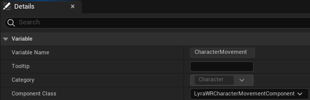
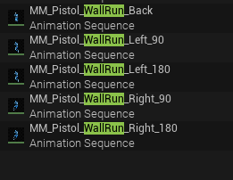
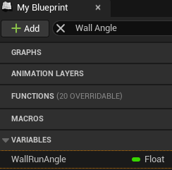
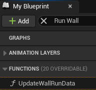
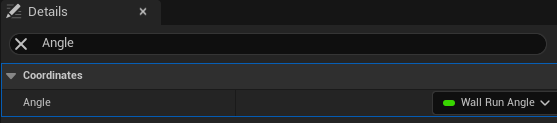

# 【UE5】Lyra に学ぶ(15) CharacterMovementComponent 拡張 <!-- omit in toc -->

UE5 の新しい？サンプル [Lyra Starter Game] 。  
今回は Lyra の CharacterMovementComponent を拡張して、壁を移動できるようにしてみます。  
ネットワーク越しでも問題ないはずです。

* バージョン
	* [Lyra Starter Game]
		* 2023/09/07 版

# Index <!-- omit in toc -->

- [0. 参考](#0-参考)
- [1. 実装の組み込み](#1-実装の組み込み)
	- [1.1. ソースコードの追加](#11-ソースコードの追加)
	- [1.2. 使用する CharacterMovementComponent を変更する](#12-使用する-charactermovementcomponent-を変更する)
- [2. アニメーションアセットの用意](#2-アニメーションアセットの用意)
	- [2.1. アニメーションモンタージュとブレンドスペースの作成](#21-アニメーションモンタージュとブレンドスペースの作成)
- [3. Animation Blueprint の変更](#3-animation-blueprint-の変更)
	- [3.1. ALI\_ItemAnimLayers の変更](#31-ali_itemanimlayers-の変更)
	- [3.2. ABP\_Mannequin\_Base の変更](#32-abp_mannequin_base-の変更)
		- [3.2.1. WallRun の壁の法線のXY平面成分を取得する関数を用意](#321-wallrun-の壁の法線のxy平面成分を取得する関数を用意)
		- [3.2.2. WallRun の状態を取得する関数を用意](#322-wallrun-の状態を取得する関数を用意)
		- [3.2.3. LocomotionSM の変更](#323-locomotionsm-の変更)
	- [3.3. ABP\_ItemAnimLayersBase の変更](#33-abp_itemanimlayersbase-の変更)
		- [3.3.1. ブレンドスペース 1D のパラメータとして使用可能な変数を用意](#331-ブレンドスペース-1d-のパラメータとして使用可能な変数を用意)
		- [3.3.2. 変数を更新するための関数を用意](#332-変数を更新するための関数を用意)
		- [3.3.3. アニメーションレイヤー `FullBody_WallRunState` の実装](#333-アニメーションレイヤー-fullbody_wallrunstate-の実装)
- [4. 動作確認](#4-動作確認)
- [5. 終わりに](#5-終わりに)

# 0. 参考

* [YouTube > delgoodie > Unreal Engine | Character Movement Component: In-Depth]
	* delgoodie 氏による CharacterMovementComponent の拡張の解説動画のプレイリストです。
	* 今回使用する実装はこちらの 10 番目の動画で紹介されている手法をベースにしています。
	* ソースコードも github で公開されています。
* https://github.com/sentyaanko/WallRunSample/tree/v0.0.1
	* delgoodie 氏のプロジェクトの WallRun の部分だけを参考にし、少し手を入れたソースを置いています。
	* 今回はこれを利用する前提です。

# 1. 実装の組み込み

基本的にはソースをプロジェクトに追加し、使用する CharacterMovementComponent を変更するだけで終了です。

## 1.1. ソースコードの追加

`LyraStarterGame\Source\LyraGame\Character\` に `LyraWRCharacterMovementComponent.cpp / .h` を追加し、ビルドします。

> [!NOTE]
> * Lyra の CharacterMovementComponent
> 	* Lyra は `ULyraCharacterMovementComponent` という `UCharacterMovementComponent` の派生クラスが作られています。
> 	* 今回用意した `ULyraWRCharacterMovementComponent` は上記のクラスを派生しています。
> 	* Lyra はアップデートが続くため、コンフリクトを避けるためにそうしています。
> 	* また、 `ULyraWRCharacterMovementComponent` は `ULyraCharacterMovementComponent` を基底クラスにしていますが、その機能は使用していません。
> 	* 基底クラスを `UCharacterMovementComponent` に変更すれば、 Lyra 以外のプロジェクトでも使用可能です。
> 	* 独自のプロジェクトで利用する際に、すでに CharacterMovementComponent がある場合はマージしてしまっても良いです。

## 1.2. 使用する CharacterMovementComponent を変更する

1. `B_Hero_ShooterMannequin` を開きます。
2. Components ウィンドウ の `Character Movement(CharMoveComp)` を選びます。  
	
3. Details ウィンドウの Component Class を `LyraWRCharacterMovementComponent` に変更します。  
	

> [!NOTE]
> * 設定するキャラクタークラス
> 	* ShooterGame 類 (ControlPoints/Elimination/ShooterGym) は `B_Hero_ShooterMannequin` を使うのでこれで反映されます。
> 	* C++ でデフォルトの CharacterMovementComponent を変更することもできます。
> 		* `ALyraCharacter` のコンストラクタで指定しているクラスを変更することで行なえます。
> 		* Lyra は ShoterGame 以外に TopDownArena 等もあり、 C++ で変更するとそのあたりにも影響するので注意が必要です。

これで、空中で壁に斜めに侵入するように移動すれば壁を移動できるようになります。

<video controls src="https://github.com/sentyaanko/ReadingLyra/assets/48474089/1c1dd75f-31ee-4a32-9442-89f19fd3c720" muted="false"></video>

# 2. アニメーションアセットの用意

これだけだと見た目を何もしていないため、落下モーションや場合によっては歩きモーションが再生されます。  
動作確認がしづらいので、仮のアニメーションを設定するために、アセットを用意します。  
具体的にはジャンプループ中のアニメーションを元に壁に足を押し付けているアニメーションを作成し、 Animation Blueprint で利用します。

## 2.1. アニメーションモンタージュとブレンドスペースの作成

* `MM_Pistol_Jump_Fall_Loop` を元に、_Back/_Left90/_Right90/_Left180/_Right180 の5種のアニメーションモンタージュを作成します。
* _Back は後方の壁に、 _Left90/_Right90 は真横の壁に、 _Left180/_Right180 は前方の壁に足をつけているアニメーションにします。  
	
* ブレンドスペース 1D を一つ作ります。  
	
* アニメーションモンタージュを 5 個とそれを使ってブレンドスペース 1D を 1 個作ります。  
* Axis Settings > Horizontal Axis の設定を以下のようにします。  
	
* Blend Samples の設定を以下のようにします。  
	

# 3. Animation Blueprint の変更

用意したアニメーションアセットを Animation Blueprint で利用します。  
ここでは仮のアニメーションを設定するだけなので、既存の Animation Blueprint を変更して対応してしまいます。  
具体的には概ね以下のような流れとなります。
* `ALI_ItemAnimLayers` に新しいステート用のアニメーションレイヤーを用意する。
* `ABP_Mannequin_Base` の `LocomotionSM` に新しいステートを作成し、上記のアニメーションレイヤーを呼び出す。
* `ABP_ItemAnimLayersBase` でアニメーションレイヤーの実装を行い、アニメーションの設定を行う。

## 3.1. ALI_ItemAnimLayers の変更

* My Blueprint ウィンドウでアニメーションレイヤー `FullBody_WallRunState` を追加します。  
	
* Details ウィンドウで他と同じ様に、グループを `ItemAnimLayers` に変更します。  
	

## 3.2. ABP_Mannequin_Base の変更

ここでは主に以下のことを行います。
* `ULyraWRCharacterMovementComponent` が保持する値を取得する関数の用意
* LocomotionSM の拡張
* アニメーションレイヤー `FullBody_WallRunState` の呼び出し

### 3.2.1. WallRun の壁の法線のXY平面成分を取得する関数を用意

* My Blueprints ウィンドウで関数 `GetWallRunNormal2D` を追加します。  
	
* Details ウィンドウで Category を `WallRun` に、 Pure にチェックを入れ、 Outputs を追加し、名前を `ReturnValue` 、型を `Vector` にします。  
	
* 出力のためのノードを組みます。  
	

### 3.2.2. WallRun の状態を取得する関数を用意

* My Blueprints ウィンドウで関数 `GetWallRunNormal2D` を複製し、 `GetWallRunStatus` を追加します。
* Details ウィンドウで Outputs の型を `EWallRunStatus` にします。
* 出力のためのノードを組みます。  
	

### 3.2.3. LocomotionSM の変更

* ステートエイリアス `WallRunSources` を追加し、 Details ウィンドウで `FallLand` 以外のチェックを入れます。  
	
* `WallRunSources` からつながる新しいステート `WallRun` を追加します。  
	
* ステートエイリアス `JumpSources` の Details ウィンドウで `WallRun` のチェックを入れます。
* ルール `WallRunSources to WallRun (rule)` を開き、遷移ルールを実装します。  
	
* ステート `WallRun` を実装します。  
	

## 3.3. ABP_ItemAnimLayersBase の変更

ここでは主に以下のことを行います。
* 使用する変数の用意
* 変数を更新するための関数の用意
* アニメーションレイヤー `FullBody_WallRunState` の実装

### 3.3.1. ブレンドスペース 1D のパラメータとして使用可能な変数を用意

* My Blueprints ウィンドウで変数 `WallRunAngle` を追加します。  
	
* Details ウィンドウで Category を `WallRun` にします。  
	

### 3.3.2. 変数を更新するための関数を用意

* My Blueprints ウィンドウで関数 `UpdateWallRunData` を追加します。  
	
* Details ウィンドウで Category を `BlueprintThreadSafeUpdate Functions` にし、 Thread Safe にチェックを入れます。  
	
* 変数 `WallRunAngle` を設定するためのノードを組みます。  
	
* 作成した関数を `BlueprintThreadSafeUpdateAnimation` の末尾で呼び出します。

> [!NOTE]
> * 要は壁の法線とアクターの向きのなす角を -180 から 180 の値で算出し、 `WallRunAngle` に設定しているだけです。

### 3.3.3. アニメーションレイヤー `FullBody_WallRunState` の実装

* `FullBody_FallLoopState` の実装をコピーし、 `FullBody_WallRunState` にペーストします。  
	
* Asset Browser ウィンドウから `BS_Pistol_WallRun` をドラッグアンドドロップします。
* ノード `BS_Pistol_WallRun` の Blendspace Player の Details ウィンドウで `Angle` を `WallRunAngle` にバインドします。  
	
* ノード `Layered blend per bone` を複製し、 `BlendMasks` を `LowerBodyMask` に変更します。  
	
* ノード `Property Access` で `GetMainAnimBPThreadSafe.GetWallRunStatus` を指定し、 WallRun の状態ごとの Blend Weight を設定できるようにします。
* 用意したノードを組み合わせます。  
	

# 4. 動作確認

* ControlPoints や Elimination をプレイするると、壁に沿って移動できるようになっているのが確認できます。

<video controls src="https://github.com/sentyaanko/ReadingLyra/assets/48474089/df5f22b9-24f4-4d69-8cae-055a89a394a5" muted="false"></video>

# 5. 終わりに

基本的な実装しかしていないので、組み込みも簡単に済ませられたと思います。  
実装も単純なので、これを元に気になるところを拡張するのも割と簡単に行えると思います。  
どなたかの参考になれば幸いです。

-----
おしまい。

<!--- ページ内のリンク --->

<!--- 自前の画像へのリンク --->

<!--- generated --->
[Lyra Starter Game]: https://www.unrealengine.com/marketplace/ja/product/lyra
[YouTube > delgoodie > Unreal Engine | Character Movement Component: In-Depth]: https://www.youtube.com/playlist?list=PLXJlkahwiwPmeABEhjwIALvxRSZkzoQpk
