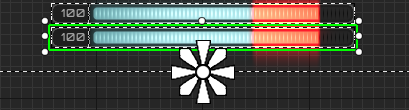

# 【UE5】Lyra に学ぶ(16) CharacterMovementComponent 拡張その２ <!-- omit in toc -->

UE5 の新しい？サンプル [Lyra Starter Game] 。  
[【UE5】Lyra に学ぶ(15) CharacterMovementComponent 拡張] では WallRun ができるようにしました。  
今回はスタミナを組み込み、 WallRun 中はスタミナを消費し、スタミナが無い場合は WallRun できなくします。  
マルチプレイでも動作するよう心がけています。

* バージョン
	* [Lyra Starter Game]
		* 2023/09/07 版 (2023/11/02 21:45 時点で更新なし)

# Index <!-- omit in toc -->

- [1. 参考](#1-参考)
- [2. 追加・変更するファイル一覧と概要](#2-追加変更するファイル一覧と概要)
- [3. 導入方法](#3-導入方法)
	- [3.1. B\_Hero\_ShooterMannequin](#31-b_hero_shootermannequin)
	- [3.2. B\_Hero\_Explorer](#32-b_hero_explorer)
	- [3.3. W\_ShooterHUDLayout](#33-w_shooterhudlayout)
- [4. 解説](#4-解説)
	- [4.1. 設計の方針について](#41-設計の方針について)
	- [4.2. C++ の実装内容について](#42-c-の実装内容について)
		- [4.2.1. ULyraWRCharacterMovementComponent](#421-ulyrawrcharactermovementcomponent)
	- [4.3. Blueprint の実装内容について](#43-blueprint-の実装内容について)
		- [4.3.1. W\_WallRunStaminabar](#431-w_wallrunstaminabar)
		- [4.3.2. C\_WallRunGravityScale](#432-c_wallrungravityscale)
	- [4.4. GameplayTag](#44-gameplaytag)
		- [4.4.1. Ability.WallRun.Stamina.Message](#441-abilitywallrunstaminamessage)
		- [4.4.2. CustomMovement.Mode.WallRunLeft](#442-custommovementmodewallrunleft)
		- [4.4.3. CustomMovement.Mode.WallRunRight](#443-custommovementmodewallrunright)
- [5. 改善点](#5-改善点)
- [6. 終わりに](#6-終わりに)


# 1. 参考

* [Unreal Engine 5.3 Documentation > インタラクティブな体験をつくりだす > ネットワークの構築とマルチプレイヤー > チュートリアルと例 > Character Movement コンポーネント]
	* `CharacterMovementComponent` の公式のドキュメントです。
	* ネットワークでの同期の流れや拡張方法などの情報があります。
* [YouTube > delgoodie > Unreal Engine | Character Movement Component: In-Depth]
	* delgoodie 氏による `CharacterMovementComponent` の拡張の解説動画のプレイリストです。
	* 今回使用する実装はこちらの 10 番目の動画で紹介されている手法をベースにしています。
	* ソースコードも github で公開されています。
* [Vitor Cantão > Recreating the Climbing System from Zelda BOTW in Unreal (C++)]
	* Vitor Cantão 氏による `CharacterMovementComponent` の拡張のチュートリアル記事です。
	* この記事では壁登りの実装をしています。
	* (アセット類を除く)ソースコードのみ github で公開されています。
* https://github.com/sentyaanko/WallRunSample/tree/v0.0.2
	* 今回使用するソースやアセットなどを置いています。
	* 今回はこれを利用する前提です。
* [【UE5】Lyra に学ぶ(15) CharacterMovementComponent 拡張]
	* 前回の記事です。事前にこちらを読んでる前提です。
* [【UE5】Lyra に学ぶ(04) GameplayMessage]
	* `GameplayMessage` を利用します。こちらの記事で簡単な説明をしています。
* 略語
	* CMC: `CharacterMovementComponent`
	* ASC: `AbilitySystemComponent`


# 2. 追加・変更するファイル一覧と概要

| 名前														| 概要																|
|----														|----																|
| 追加するソース											| 																	|
| `LyraWallRunStaminaStaminaMessage.cpp / .h`				| `GameplayMessage` で送信する構造体を定義。						|
| `LyraWallRunStaminaStamina.cpp / .h`						| 自動的に回復する属性用の構造体とクラスを定義。					|
| `LyraWRCharacterMovementComponent.cpp / .h`				| スタミナ対応のための拡張。										|
| 変更するソース											| 																	|
| `LyraGameplayTags.cpp / .h`								| WallRun 用の [GameplayTag] の追加。								|
| 変更するコンフィグ										| 																	|
| `DefaultGameplayTags.ini`									| [GameplayTag] の追加。											|
| 追加するアセット											| 																	|
| [W_WallRunStaminabar]										| スタミナ用の widget 。											|
| [C_WallRunGravityScale]									| WallRun 中に発生する重力加速度の係数用カーブ。					|
| 変更するアセット											| 																	|
| [B_Hero_ShooterMannequin]									| CMC の変更。														|
| [B_Hero_Explorer]											| 同上。															|
| [W_ShooterHUDLayout]										| 追加した widget のレイアウト設定の追加							|


# 3. 導入方法

1. `Epic Launcher` から、 `Lyra Starter Game` のプロジェクトを作成します。
1. github に置いてあるファイルをコピーします。
	* 追加・更新したテキストファイルと追加したバイナリファイルのみ置いています。
	* これは `Lyra Starter Game` のバージョンアップ時のコンフリクトを避けるためです。
1. `Visual Studio` などでビルドします。
1. `Unreal Editor` で既存のアセットを変更します。

以下に変更が必要な既存のアセットの変更方法を記述します。

## 3.1. B_Hero_ShooterMannequin

CMC を独自のものに変更します。

* コンポーネント `Character Move(CharaMoveComp)` を選択し、  
	
* *Details > Variable > Component Class* を [ULyraWRCharacterMovementComponent] に変更します。  
	
* *Details > Lyra WR > WallRun > Wall Run Gravity Scale Curve* を [C_WallRunGravityScale] に変更します。(しなくても動作はします)  
	


> [!NOTE]
> ShooterGame 類 (ControlPoints/Elimination/ShooterGym 等) で WallRun をする場合に必要です。

## 3.2. B_Hero_Explorer

[B_Hero_ShooterMannequin] と同様の変更をします。

> [!NOTE]
> `L_InventoryTestMap` / `L_InteractionTestMap` で WallRun をする場合に必要です。

## 3.3. W_ShooterHUDLayout

スタミナ用の widget が表示されるようにレイアウトの設定を行います。

* コンポーネントを追加します。  
	
* 位置を設定します。  
	

# 4. 解説

## 4.1. 設計の方針について

今回の実装に当たっての設計の方針です。正解というわけではなく、そうしたという話です。

* 操作レスポンスを考慮する。
	* `ALyraPlayerState::StatTags` の利用は避ける。
		* この仕組みは ShooterGame のスコア関連で使用されています。
		* また、武器用のクラスも同様の `StatTags` を保持しており、そちらでは銃器の弾薬数で使用されています。
		* このクラスを使用すると、サーバーのみで実行される `AddStatTagStack` で値を操作し、レプリケーションされた値をクライアントで表示に利用することが出来ます。
		* この方法だと、減り始めや尽きるタイミングがどうしてもサーバーより遅れるため、 `サーバー修正` の回避が困難で、利用メリットがありません。
	* 単純な `AttributeSet` / `GameplayEffect` の利用は避ける。
		* スタミナ値は増減が激しいため、レプリケーションの設定に工夫が必要になるはずです。
		* さもないと、頻繁なレプリケーションとヒッチを引き起こします。
			* これは、増減中にサーバー/クライアント各々がスタミナの現在値の更新を行う為です。
* スタミナは他のユーザーからは見えなくて良いとする。
	* スタミナの *現在値* のサーバー/クライアント同期は行わない。
	* 基本的にサーバー/クライアント各々で計算を行う。
* widget の値は正確でなくても良いとする。
	* 値の増加/減少が始まった/終わった などのタイミングで `GameplayMessage` を送り、内容の更新を行う。

## 4.2. C++ の実装内容について

定義している型と概要は以下のとおりです。

| 型名											| 概要																				|
|----											|----																				|
| `FLyraWallRunStaminaMessage`					| スタミナ値の変更があったことを widget へ知らせる際に使用。						|
| 												| 																					|
| `FAutoRecoverableAttributeSetting`			| 自動回復する属性に関する設定を Blueprint で調整することを目的とした構造体。		|
| `FSavedAutoRecoverableAttribute`				| 自動回復する属性を表す構造体。													|
| `FSafeAutoRecoverableAttribute`				| 上記二つをを内包した、自動回復する属性を操作するための構造体。					|
| 												| 																					|
| `ECustomMovementMode`							| このプロジェクトで使用する `CustomMovementMode` を表す列挙体。					|
| `EWallRunStatus`								| WallRun の状態を示す列挙体。														|
| [ULyraWRCharacterMovementComponent]			| `CharacterMovementComponent` の派生クラスで WallRun の拡張をしたクラス。			|

以下にコンポーネントクラスについての補足を記述します。


### 4.2.1. ULyraWRCharacterMovementComponent

 * このクラス内に `FSafeAutoRecoverableAttribute` を保持しています。
	 * *Phys\* 関数* などで直接この値を変更します。
 * `FSavedMove` 内に `FSavedAutoRecoverableAttribute` を保持しています。
	 * `FSavedMove` の各種関数内で [ULyraWRCharacterMovementComponent] の `FSafeAutoRecoverableAttribute` を読み書きします。

> [!NOTE]
> * `FSavedMove` について
> 	* `FSavedMove_Character` のコメントより
> 		> `FSavedMove_Character` represents a saved move on the client that has been sent to the server and might need to be played back.  
> 		> 
> 		> ----
> 		> `FSavedMove_Character` は、サーバーに送信され、プレイバックする必要があるかもしれない、クライアントで保存された移動を表します。
> 	* クライアントサイドの CMC ではサーバーとの移動の同期完了まで同期単位ごとの移動情報を保持する `FSavedMove` と呼ばれる構造体のバッファを保持しています。
> 		* これはサーバーサイドでは保持していません。
> 		* `Listen Server` の場合でも、自身が操作するキャラクターに関しても保持しません。
> 		* `Standalone` の場合も同様に保持しません。
> * `FSavedMove` のサイズ
> 	* 現在のバージョンでは `FSavedMove_Character` は 1120 byte あります。
> 	* 派生した `FSavedMove_WallRun` は 1152 byte ありました。
> 	* この構造体はデフォルトで最大 96 個保持しますので、 3k byte 程使用メモリが増えることになります。
> * `FSavedMove` に保存しているもの
> 	* プレイバックに必要な情報を置く必要があります。
> 	* どういうことかというと、 `FSavedMove` にある情報と、今回の deltaTime から今回の移動情報を構築できる必要があります。
> 	* 例えば、 以下のような情報を保存しています。
>		```c++
>			// @brief 増加/減少が始まった際の値
>			float BaseValue;
>		
>			// @brief 増加/減少が始まってからの経過時間
>			float TotalDeltaSeconds;
>		```
> 	* これらを利用して、 `BaseValue + (TotalDeltaSeconds + deltaTime) * {時間ごとの増減値}` のような形で現在値をいつでも計算できるようにしています。
> 	* より詳しくは `FSavedMove_Character` のジャンプ関連の変数について調べることをおすすめします。


> [!NOTE]
> * 使用可能な `CustomMovementMode` の値
> 	* `UCharacterMovementComponent::PackNetworkMovementMode()` を見ると、 `MovementMode` を通信で送る際、 `MovementMode` / `GroundMovementMode` / `CustomMovementMode` が uint8 にパックされます。
> 	* そのため、 `CustomMovementMode` 自体は uint8 で定義されていますが、 256 通りの値すべてを使えるわけでは有りません。
> 	* 具体的には上記の関数で `MovementMode` が `MOVE_Custom` の場合は `CustomMovementMode` に `PackedMovementModeConstants::CustomModeThr` を加えた値をパックした値として利用されます。
> 	* `PackedMovementModeConstants::CustomModeThr` はこの関数の上で定義されている定数で、現状では 16 (0b00010000) です。
> 		* `MOVE_MAX` に依存しており、これが増えると変わります。（影響範囲が大きそうなのでそうそう変わらないとおもいます。）
> 	* つまり、 4 bit 目を使用できないものと考え、また、 0 も無効な値扱いとすると、使用出来るのは 127 通りとなります。（恐らく。）


## 4.3. Blueprint の実装内容について

以下に新規で追加している [W_WallRunStaminabar] / [C_WallRunGravityScale] についての補足を記述します。

### 4.3.1. W_WallRunStaminabar

*  `W_Healthbar` を複製して作成した、スタミナの状態を示す widget です。
* Gameplay Message で `FLyraWallRunStaminaMessage` を受け取り表示を更新します。
	* ですので、 *スタミナの現在値* をそのまま表示しているわけではありません。

### 4.3.2. C_WallRunGravityScale

* 速度と加速度の余弦をパラメータとして重力加速度の係数を取得するためのカーブです。

## 4.4. GameplayTag

追加した [GameplayTag] の一覧とその概要と定義場所は以下のようになります。

| 名前												| 概要													| 定義場所 						|
|----												|----													|----							|
| [Ability.WallRun.Stamina.Message]					| `GameplayMessage` の種類を示す。						| `DefaultGameplayTags.ini`		|
| [CustomMovement.Mode.WallRunLeft]					| 左側が壁の WallRun をしていることを示す。				| `LyraGameplayTags.cpp / .h`	|
| [CustomMovement.Mode.WallRunRight]				| 右側が壁の WallRun をしていることを示す。				| `LyraGameplayTags.cpp / .h`	|

以下に補足を記述します。


### 4.4.1. Ability.WallRun.Stamina.Message

* `GameplayMessage` で `FLyraWallRunStaminaMessage` を送る際のチャンネルの値として使用。

### 4.4.2. CustomMovement.Mode.WallRunLeft

* `LyraGameplayTags.cpp / .h`
	* 定義と宣言を行っています。
	* 連想配列 `CustomMovementModeTagMap` の値(キーは対応する `ECustomMovementMode`)として利用しています。
* `ALyraCharacter` 
	* `MovementMode` 切替時のデリゲート内で(前述の `CustomMovementModeTagMap` を元に)自身の ASC に付与しています。

### 4.4.3. CustomMovement.Mode.WallRunRight

[CustomMovement.Mode.WallRunLeft] と同様です。


# 5. 改善点

* 死亡時の処理
	* ヘルスと同様に一旦 0 にする処理などが入っていません。
	* `W_Healthbar` を参考に [W_WallRunStaminabar] 内でヘルスを監視することで実現できると思います。
* 機能の分割
	* CMC にスタミナの制御までさせてしまっていますが、拡張を考えると分割したほうが良いと思います。
	* 例えば以下のような変更をするとコンテンツの自由度が増すはずです。
		* 固定の構造体に設定している回復量等を `AttributeSet` に変更
		* `GameplayEffect` で値を変更できるようにする
	* そのあたりはヘルスの作り方が参考になると思います。
	* 注意点としては `FSavedMove` に置くデータの精査です。詳しくは前述の Note を参照してください。
* WallRun のトリガー
	* 現状だと、壁に斜めに侵入する様に移動することで自動的に WallRun に移行します。
	* 「 WallRun に移行できるようになったら操作ヘルプを出し、ボタンを押すことで WallRun に移行する」ような仕様も考えられます。
	* これを行いたい場合は、ジャンプの実装を参考にすると良いと思います。
* `FastShared movement updates` の対応
	* 私が知る範囲では 5.2.1 (Ver. 2023-09-07) の時点で、 `LyraCharacter.cpp / .h` 内で、 `FSharedRepMovement` という構造体を初め、いくつかの関数なども追加実装されています。
	* 以下は `UFUNCTION(NetMulticast, unreliable) void FastSharedReplication(const FSharedRepMovement& SharedRepMovement);` のコメントです。
		> RPCs that is called on frames when default property replication is skipped. 
		> This replicates a single movement update to everyone.
		> 
		> ----
		> デフォルトのプロパティ レプリケーションがスキップされたときにオン フレームで呼び出される RPC です。
		> これは、 1 つの動きの更新を全員にレプリケートします。
	* 用途はコメントのとおりだと思いますが、この機能への影響は確認はしていません。

# 6. 終わりに

基本的な実装しかしていないので、組み込みも簡単に済ませられたと思います。  
実装も単純なので、これを元に気になるところを拡張するのも割と簡単に行えると思います。  
どなたかの参考になれば幸いです。


-----
おしまい。

[【UE5】Lyra に学ぶ(04) GameplayMessage]: Lyra04_GameplayMessage.md
[【UE5】Lyra に学ぶ(15) CharacterMovementComponent 拡張]: Lyra15_OverrideCharacterMovementComponent.md

<!--- ページ内のリンク --->
[B_Hero_ShooterMannequin]: #31-b_hero_shootermannequin
[B_Hero_Explorer]: #32-b_hero_explorer
[W_ShooterHUDLayout]: #33-w_shooterhudlayout
[ULyraWRCharacterMovementComponent]: #421-ulyrawrcharactermovementcomponent
[W_WallRunStaminabar]: #431-w_wallrunstaminabar
[C_WallRunGravityScale]: #432-c_wallrungravityscale
[GameplayTag]: #44-gameplaytag
[Ability.WallRun.Stamina.Message]: #441-abilitywallrunstaminamessage
[CustomMovement.Mode.WallRunLeft]: #442-custommovementmodewallrunleft
[CustomMovement.Mode.WallRunRight]: #443-custommovementmodewallrunright

<!--- 自前の画像へのリンク --->

<!--- generated --->
[Lyra Starter Game]: https://www.unrealengine.com/marketplace/ja/product/lyra
[Unreal Engine 5.3 Documentation > インタラクティブな体験をつくりだす > ネットワークの構築とマルチプレイヤー > チュートリアルと例 > Character Movement コンポーネント]: https://docs.unrealengine.com/5.3/ja/understanding-networked-movement-in-the-character-movement-component-for-unreal-engine/
[Vitor Cantão > Recreating the Climbing System from Zelda BOTW in Unreal (C++)]: https://www.vitorcantao.com/post/climbing-system/
[YouTube > delgoodie > Unreal Engine | Character Movement Component: In-Depth]: https://www.youtube.com/playlist?list=PLXJlkahwiwPmeABEhjwIALvxRSZkzoQpk
